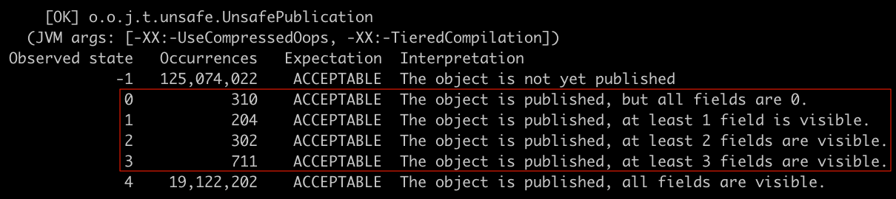
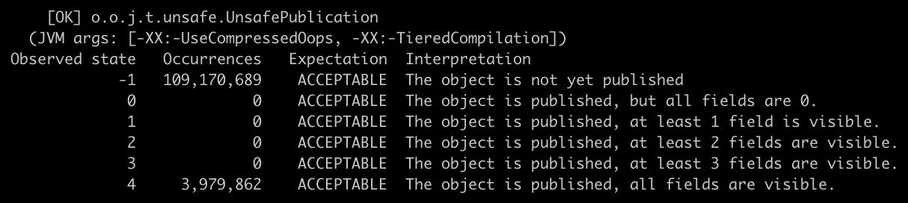

关于 Java 编程中的单例模式，笔者最常使用的是内部静态类的实现，或者枚举实现。

```java
// 内部静态类的实现
public class Singleton1 {
  private static class SingletonHolder {
    private static final Singleton1 INSTANCE = new Singleton1();
  }
  private Singleton1() { ... }
  public static Singleton1 getInstance() {
    return SingletonHolder.INSTANCE;
  }
  // Singleton1.getInstance().doSomething();
  public void doSomething() { ... }
}

// 枚举实现
public enum Singleton2 {
  INSTANCE;
  // Singleton2.INSTANCE.doSomething();
  public void doSomething() { ... }
}
```

我们都知道 Java 中的静态代码块会在类被加载时执行，并且全局只存在一份，所以使用静态代码块实现的单例模式都是线程安全的。具体到内部静态类的实现，由于 SingletonHolder 是私有的，在第一次 `getInstance()` 时才会被加载，因此是一种懒汉式的单例模式。而枚举实现本质上也是静态代码块，我们可以查看 Singleton2 的字节码：

```java
// javac Singleton2.java
// javap -c Singleton2.class
Compiled from "Singleton2.java"
public final class Singleton2 extends java.lang.Enum<Singleton2> {
  public static final Singleton2 INSTANCE;
  ...

  static {};
    Code:
       0: new           #4 // class Singleton2
       3: dup
       4: ldc           #7 // String INSTANCE
       6: iconst_0
       7: invokespecial #8 // Method "<init>":(Ljava/lang/String;I)V
      // highlight-next-line
      10: putstatic     #9 // Field INSTANCE:LSingleton2;
      13: iconst_1
      14: anewarray     #4 // class Singleton2
      17: dup
      18: iconst_0
      19: getstatic     #9 // Field INSTANCE:LSingleton2;
      22: aastore
      23: putstatic     #1 // Field $VALUES:[LSingleton2;
      26: return
}
```

可以看到，枚举实际上被 javac 转换成了继承自 `java.lang.Enum` 的类实现；而枚举的常量则被转换成了静态常量，在这个类被加载时会自动初始化。因此枚举实现的单例实际上是一种饿汉模式的单例。尽管饿汉模式稍微浪费了一些性能，但《Effective Java》的作者 Joshua Bloch 依然[认为枚举实现是最佳的单例实现](https://www.drdobbs.com/jvm/creating-and-destroying-java-objects-par/208403883?pgno=3)：

> This approach is functionally equivalent to the public field approach, except that it is more concise, provides the serialization machinery for free, and provides an ironclad guarantee against multiple instantiation, even in the face of sophisticated serialization or reflection attacks. While this approach has yet to be widely adopted, a single-element enum type is the best way to implement a singleton.

当然我们都知道还有一种双重检查锁的实现，由于涉及到了 synchronized 和 volatile 这两个关键字，因此经常成为 Java 编程基础的面试题。一个典型的双重检查锁的实现如下：

```java
public class Singleton3 {
  private static volatile Singleton3 sInstance;
  private Singleton3() { ... }

  public static Singleton3 getInstance() {
    if (sInstance == null) { // #1
      synchronized (Singleton3.class) {
        if (sInstance == null) { // #2
          sInstance = new Singleton3();
        }
      }
    }
    return sInstance;
  }

  // Singleton3.getInstance().doSomething();
  public void doSomething() { ... }
}
```

双重检查锁的代码比较好理解。在并发环境中调用 `getInstance()` 时，可能有多个线程同时进入了 #1 处的 if；当第一个持有类锁的线程释放锁以后，还会有其他（之前被阻塞的）线程再次进入同步代码块；为了避免多次初始化实例，所以需要在 #2 处再写一个 if。

问题是 volatile 在此处的作用。笔者一直以为 volatile 是为了保证内存可见性，比如说要保证 `sInstance` 赋值及时生效，尽量避免其他（之前被阻塞的）线程越过 #2 处，导致多次初始化实例。但实际上并不是这样。synchronized 在退出同步代码块时，[已经保证了可见性](https://docs.oracle.com/javase/tutorial/essential/concurrency/syncmeth.html)：

> Second, when a synchronized method exits, it automatically establishes a happens-before relationship with any subsequent invocation of a synchronized method for the same object. This guarantees that changes to the state of the object are visible to all threads.

实际上 volatile 在此处的作用是**禁止指令重排**。借用网上大多数博客的说法，`sInstance = new Singleton3();` 并不是一个原子操作，而是会被分解为三个步骤：

1. 为 Singleton3 实例分配内存空间
2. 调用 Singleton3 的构造器
3. 将内存空间指向 `sInstance`

在没有 volatile 修饰时，上述初始化步骤可能会被 JIT 优化为 1 → 3 → 2。于是可能会发生：

1. 当第一个线程 A 执行初始化步骤 1 → 3 时，有另外一个线程 B 恰好执行到 #1 处
2. 因为 `sInstance` 已经被指向了一块内存空间，所以 `sInstance != null` 会被直接返回
3. 接着 B 尝试调用 `doSomething()` ，但由于 `sInstance` 还没有被构造完毕，可能会出错

```java
A  B
↓  ↓  public static Singleton3 getInstance() {
↓  ↓    if (sInstance == null) { // #1
↓         synchronized (Singleton3.class) {
↓           if (sInstance == null) { // #2
↓             sInstance = new Singleton3();
            }
          }
        }
        return sInstance;
      }
```

听起来像是那么回事。但以上都是口口相传的理论，我们需要可复现的证明。正常情况下，就算我们把 volatile 去掉，在自己的机器上也是很难复现指令重排导致的出错。不过幸运的是，4 年前的一个 [StackOverflow](https://stackoverflow.com/q/35883354/4696820) 问题恰好可以解决我们这方面的疑惑。

OpenJDK 提供了一个名为 [jcstress](https://wiki.openjdk.java.net/display/CodeTools/jcstress) 并发压测工具，并提供了一份名为 [UnsafePublication](http://hg.openjdk.java.net/code-tools/jcstress/file/901860a6cb61/tests-custom/src/main/java/org/openjdk/jcstress/tests/unsafe/UnsafePublication.java) 的 Java 代码用来测试指令重排。我们也可以用来测试有无 volatile 的情况。

我们可以把测试代码下载到本地，注意是 hg 不是 git：

```text
$ hg clone http://hg.openjdk.java.net/code-tools/jcstress/ jcstress
$ cd jcstress/
```

然后编译并运行 UnsafePublication，注意 JDK 版本务必 >= 9：

```text
$ mvn clean install -pl tests-custom -am
$ java -XX:-UseCompressedOops -jar tests-custom/target/jcstress.jar -t ".*UnsafePublication.*" -v
```

受限于篇幅原因，这里就只附上 UnsafePublication 与运行结果有关的代码片段：

```java
public class UnsafePublication {
  int x = 1;

  // 默认没有 volatile 修饰
  MyObject o;

  // 多个线程同时调用 publish()
  @Actor
  public void publish() { o = new MyObject(x); }

  // 多个线程同时调用 consume()，
  // 这里 jcstress 依赖 res.r1 的值判断有几个成员变量被初始化
  @Actor
  public void consume(I_Result res) {
    res.r1 = o != null ? o.x00 + o.x01 + o.x02 + o.x03 : -1
  }

  static class MyObject {
    int x00, x01, x02, x03;
    public MyObject(int x) {
      x00 = x; x01 = x; x02 = x; x03 = x;
    }
  }
}
```

我们可以看到，MyObject 是默认没有 volatile 修饰的，此时测试结果如下：



我们可以将代码改成 `volatile MyObject o;` 然后重新编译运行之：



对比两张截图可以看到，在一亿多次运行过程中，没有 volatile 修饰的测试结果出现了只有部分成员变量被初始化的情况，而加上 volatile 修饰的测试结果则没有出现。

最后，尽管上述测试用例是每次都简单的 new，也要经过一亿多次运行后，才出现了一千多次指令重排导致的出错；如果改造成没有 volatile 修饰的双重检查锁的单例实现，出错的概率显然更小了——但我们仍然不能避免指令重排导致的出错。因此在双重检查锁的单例实现中，关键字 volatile 是必不可少的，它在此处的作用就是禁止指令重排。
