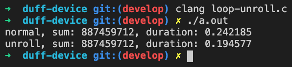
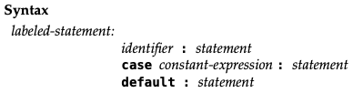

达夫设备 (Duff's Device) 可能是迄今为止最令人疑惑的 C 代码之一，达夫向我们展示了 switch 语句不可思议的特性。理解达夫设备有助于我们实现一种朴素的协程。

在开始介绍达夫设备之前，我们需要了解名为 [循环展开](https://zh.wikipedia.org/wiki/%E5%BE%AA%E7%8E%AF%E5%B1%95%E5%BC%80) 的概念：

> 循环展开是一种牺牲程序的尺寸来加快程序的执行速度的优化方法。可以由程序员完成，也可由编译器自动优化完成。循环展开最常用来降低循环开销，为具有多个功能单元的处理器提供指令级并行。也有利于指令流水线的调度。

一个循环展开的示例代码如下：

```c
// 正常情况下的 for 循环，
// 需要连续迭代 100000000 次
int sum = 0;
for (int i = 0; i < 100000000; i++) {
    sum += i;
}

// 每次循环展开 5 次，
// 只用迭代 20000000 次即可
int sum = 0;
for (int i = 0; i < 100000000; i += 5) {
    sum += i;
    sum += i + 1;
    sum += i + 2;
    sum += i + 3;
    sum += i + 4;
}
```

读者可以猛击 [loop-unroll.c](https://github.com/mthli/blog/blob/master/content/blog/duff-device/loop-unroll.c) 获取完整代码，编译并运行之，得到如下结果：



可以看到，在 100000000 次求和过程中，循环展开 (unroll) 比正常情况 (normal) 快了大概 47 毫秒。尽管在 2020 年的今天这点提升微不足道，但在上古时期硬件性能薄弱的情况下，应该还是很明显的。目前主流的编译器也都提供了循环展开的优化选项，例如 Clang 就提供了 [#pragma unroll](https://clang.llvm.org/docs/AttributeReference.html#pragma-unroll-pragma-nounroll)，不再需要程序员手动展开了。

现在就让我们来了解一下什么是达夫设备吧。我相信没有什么是比达夫本人的描述更准确了，事实上我们可以追溯到 1983 年 11 月达夫 [描述这一想法的邮件](https://swtch.com/duffs-device/td-1983.txt)。以下是我的译文，正文部分为达夫本人的邮件内容，*斜体部分为翻译过程中的补充*。

---

有如下一段程序 (routine) ，是从 [Evans & Sutherland Picture System II](https://en.wikipedia.org/wiki/Evans_%26_Sutherland) 中提取出来的，用于将一个 short 数组拷贝到 IO 数据寄存器上：

```c
send(to, from, count)
register short *to, *from;
register count;
{
    do
        *to = *from++;
    while (--count > 0);
}
```

（显然，当 `count` 为 0 时就会停止运行）

[VAX](https://zh.wikipedia.org/wiki/VAX) 的 C 编译器会将上述循环编译为两条指令（我认为分别是 `movw` 指令和 `sobleq` 指令）。事实证明，这段程序正是实时播放动画程序的瓶颈，大概慢了 50%。标准的处理方式是通过循环展开，减少 `sobleq` 指令的调用次数，从而取得更高的速度。当你这样做时，你还得处理循环结束后剩下的那部分数据*（译者注，循环次数不一定能被展开次数整除，所以需要额外处理整除不尽的余数）*。我的习惯是把循环展开的语句拷贝一份作为 switch 语句。当然啦，如果我是写汇编的话，我会选择直接跳转到循环展开的语句中。一想到这里，我便在昨天写出了如下实现：

```c
send(to, from, count)
register short *to, *from;
register count;
{
    register n = (count + 7) / 8;
    switch (count % 8) {
    case 0: do { *to = *from++;
    case 7:      *to = *from++;
    case 6:      *to = *from++;
    case 5:      *to = *from++;
    case 4:      *to = *from++;
    case 3:      *to = *from++;
    case 2:      *to = *from++;
    case 1:      *to = *from++;
            } while (--n > 0);
  }
}
```

感觉很恶心？但是它能通过编译，并且运行得很好。我对这个发现既自豪又反感。如果之前没有人想到过这个实现，我打算以自己的名字命名它。

令我惊讶的是，在写了 C 语言十年之后，仍然有一些小角落是我没有探索过的（事实上，我还有另外一种使用 switch 的方式来实现状态机的中断，但实现起来也是太可怕了）。

很多人（甚至是 bwk? ）都说过，C 语言最糟糕的特性便是 switch 语句不会在遍历完所有 case 之前自动 break。这段代码印证了这种观点，但我不确定是支持还是反对。

---

以上就是达夫的邮件的全部译文了。部分读者可能不是很理解文中所说的「你还得处理循环结束后剩下的那部分数据」是什么意思，我们可以看看达夫设备在正常情况下的等价代码（代码示例来自 [维基百科](https://zh.wikipedia.org/wiki/%E8%BE%BE%E5%A4%AB%E8%AE%BE%E5%A4%87#%E6%80%A7%E8%83%BD%E8%A1%A8%E7%8E%B0)：

```c
send(to, from, count)
register short *to, *from;
register count;
{
    register n = (count + 7) / 8;

    // 循环次数不一定能被展开次数整除，
    // 所以需要额外处理整除不尽的余数；
    // 此处 switch 没有 break 语句，
    // 会自动从余数匹配的 case 向下遍历执行 (falls through)
    switch (count % 8) {
        case 0: *to = *from++;
        case 7: *to = *from++;
        case 6: *to = *from++;
        case 5: *to = *from++;
        case 4: *to = *from++;
        case 3: *to = *from++;
        case 2: *to = *from++;
        case 1: *to = *from++;
    }

    // 每次循环展开 8 次
    while (--n > 0) {
        *to = *from++;
        *to = *from++;
        *to = *from++;
        *to = *from++;
        *to = *from++;
        *to = *from++;
        *to = *from++;
        *to = *from++;
    }
}
```

可以看到，达夫把正常情况下分开写的 switch 语句和 while 语句整合在了一起，形成了令人疑惑的 switch 和 while 交错在一起的代码，但是代码量减少了将近一半。正常情况下我们会将 case 语句的作用域视作一个单独的代码块 (block), 而达夫设备表明实际上并不是这样。所以为什么可以这样写呢？

我们可以查阅最新的 [C17 草案 PDF 版本](https://web.archive.org/web/20181230041359if_/http://www.open-std.org/jtc1/sc22/wg14/www/abq/c17_updated_proposed_fdis.pdf)，直接跳转到在 6.8 Statements and blocks, 可以看到 case 语句属于 Labeled statements（带标签的语句：



并且任何一条语句都能在自己前面声明一个标识符作为标签名称，标签本身并不会改变控制流，控制流在它们之间执行不受阻碍：

> Any statement may be preceded by a prefix that declares an identifier as a label name. Labels in
themselves do not alter the flow of control, which continues unimpeded across them.

达夫设备的巧妙之处在于，它巧妙地利用了 Labeled statements 不改变控制流的语法定义；而正常情况下我们会将 case 语句的作用域视作一个单独的代码块，仅仅是 code style 的最佳实践而已，并不是编译器强约束的。

当达夫设备开始运行时，会先根据 switch 匹配到对应的 case 语句，由于没有声明 break 所以会一路向下执行 (falls through) 直到被 while 捕获，进入循环逻辑。这里有一份模拟达夫设备的 C 代码 [duff-like.c](https://github.com/mthli/blog/blob/master/content/blog/duff-device/duff-like.c) 以及对应的汇编文件 [duff-like.s](https://github.com/mthli/blog/blob/master/content/blog/duff-device/duff-like.s)，读者可以很轻松地验证这段运行逻辑，关注 `ja`, `jg`, `jmp`, `jmpq` 之类的跳转指令即可，这里就不展开了。

达夫设备是特定时期的特定产物，现在几乎不能见到这样的循环展开实现了。但正如文章开头所述，理解达夫设备有助于我们实现一种朴素的协程，感兴趣的同学可以参见笔者的这篇译文 [使用 C 语言实现协程](https://mthli.xyz/coroutines-in-c/) 。
