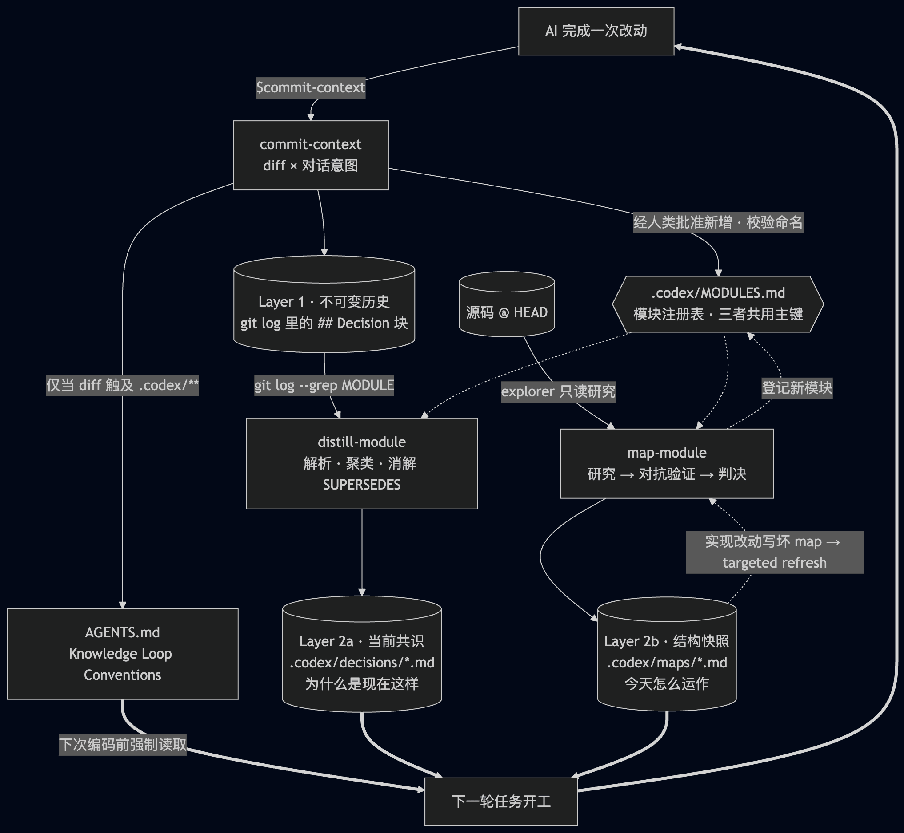

很久没有写博客了，距离我上一篇 [正式的博客](https://mthli.xyz/gpt-limit/) 已经过去了三年多，连 npm 都构建失败了。直到让 Claude 帮我修复后才得以发布这篇文章。

毫无疑问，这三年，尤其是 2025 年底 Opus 4.5 发布以来，编程领域发生了翻天覆地的变化，我相信现在还在坚持手写业务代码的程序员应该是少数了。虽然我有时还是会手写一些，毕竟代码也是一种 prompt。

在这个过程中，我们很自然地会面对一些问题。比如随着 AI 写代码的部分越来越多，我们人类对项目的掌控力度是在下降的；在项目初期，我们还能把控完整的上下文；但半年以后，我们基本改不动 AI 写的代码了。比如没有良好的索引，每次 AI 在检索代码库时都要消耗大量的 token；且不同模型的上下文窗口和能力不一致，你也不能指望每个模型从代码反推出的逻辑是一致的。比如同事问你这个功能是怎么实现的，你说不知道，直接问 AI…

不论如何，以上问题都说明，我们需要一套良好的上下文管理系统，不论是用于提升 AI 编程的效率，还是辅助人类对项目的理解。于是我设计了一套基于 git 的最小化知识循环系统，这套系统不需要你安装任何多余的依赖，只需要引入以下三个 skills 即可很好地运行。

## 概览

首先这三个 skills 都是 Codex 版本，因为我目前就职的公司只能使用 Codex（即使我的个人项目使用的是 Claude）。不过这也正好说明了它们身经百战，见得多了，识得唔识得 🐸

你总是可以在以下链接获取到最新的版本，你也可以让 AI 帮你改成你熟悉的 harness 版本：

- [commit-context](https://github.com/mthli/skills/tree/codex/commit-context) - 提交当前 diff 并附上相关的对话上下文，以及决策（Decision）
- [distill-module](https://github.com/mthli/skills/tree/codex/distill-module) - 将 Git Decision 记录蒸馏到 `.codex/decisions/<id>.md`
- [map-module](https://github.com/mthli/skills/tree/codex/map-module) -  用 subagent 研究 + 对抗性验证，产出核实过的 `.codex/maps/<id>.md`

而它们之间的流程关系是这样的：



不要慌！我只是想简单表达一下这是个循环（loop）而已。具体使用方式且听我娓娓道来。

## commit-context

需求都是聊出来的。不论你是使用 [grill-me](https://www.aihero.dev/skills-grill-me) 还是直接用产品经理产出的文档，你总是要和 AI 对话（Conversation）；在对话和编码过程中，必然涉及到一系列决策（Decisions）；而最终的产物当然就是代码。对话 + 决策 + 代码，有这三者我们就能很好地还原出当时的上下文，而你甚至可以让同事复现 AI 的神迹。

所以在 AI 写完代码之后，我们只需要运行 `$commit-context`，AI 就会自动把对话和决策写到 git commit message 里，于是我们大概就会看到这样的 git log

```text
# Conversation Log

- User:      <关键请求、约束或澄清>
- Assistant: <关键动作或用户可见的结果>

# Decisions

## Decision 1
- MODULE:       <来自 .codex/MODULES.md 的精确 ID>
- WHY:          <一行动机>
- ALTERNATIVES: <考虑过的方案，用 " / " 分隔>
- CHOSEN:       <最终实现的方案>
- TRADEOFFS:    <这个选择放弃了什么>
- RISKS:        <需要盯着的风险>
- SUPERSEDES:   <可选：被替代的决策摘要与 commit hash>

# Files Modified

- <路径> — <该暂存改动的语义描述及其目的>

# Token Usage

- Input tokens:            <输入 token 数>
- Output tokens:           <输出 token 数>
- Reasoning output tokens: <推理输出 token 数>
- Cache read tokens:       <缓存读取 token 数>
- Cache creation tokens:   <缓存创建 token 数>
- Total tokens:            <总 token 数>
- Total cost:              <costUSD，保留四位小数；缺失或为零时省略>
- Models used:             <排序后的模型名>
```

这里的 `MODULE` 指的是业务模块，比如相机、选图、首页等等。如果 `$commit-context` 发现一个新模块不存在，它会自动辅助你创建一个新模块 ID，并注册到 `.codex/MODULES.md`，且这些模块 ID 在另外两个 skills 里也会同样被引用到（通过模块 ID 将三者关联起来）。

当然也不是所有改动都要执行 `$commit-context`，你可以酌情简单 commit，只要不是大改动会影响到整个知识循环就行。另外我在这个 skill 里加了一些私心，把 token 消耗也记录上了，毕竟这样我就可以统计到这个需求我花了多少钱，哈哈（你也可以去掉）。

## distill-module

现在所有原始信息（上下文）都记录在 git log 里了，但是让 AI 每次都检索 git log 毕竟是效率低的，所以我们需要定期蒸馏 git log，能让 AI 快速检索出对应模块的改动。

我一般在完成一个大需求，或者 App 发新版本以后，会运行一次针对所有模块的 `$distill-module`。你将会在 `.codex/decisions/<id>.md` 里看到这样的信息：

```text
# <模块显示名> Decisions

> 当前共识快照。演化过程见：`git log --grep="MODULE: <id>"`
> 最近蒸馏时间：<YYYY-MM-DD>（HEAD = <短 sha>）

## Active

### D1: <改写后的简短标题>

- **What**:      <一句话说明当前采用的做法>
- **Why**:       <一句话说明动机>
- **Tradeoffs**: <一句话说明接受了哪些代价>
- **Watch out**: <一句话说明风险>
- **Source**:    <短 sha 1>, <短 sha 2>

## Superseded

- ~~<旧决策>~~ → 已被 **D1** 取代，见 <短 sha>（<YYYY-MM-DD>）
```

为了防止决策文件积累的越来越长，`$distill-module` 也会自动对决策进行压缩，保证 AI 的注意力不会过多分散在历史的长河中 👑

## map-module

嗯，其实如果对于新项目而言，前两个 skills 已经够用了。但我们才刚刚进入 Coding Agent 时代不过短短一年，仍然有很多前 AI 时代的代码仓库需要处理。这显然需要一套探索机制，能尽量准确地摸清历史逻辑，并快速接入我们这套 git 知识循环系统。

这时我们就需要使用 `$map-module` 对源码进行研究 + 对抗性验证。「对抗性验证」这个概念很好，这是从 Claude Code 的 [Dynamic Workflows](https://code.claude.com/docs/zh-CN/workflows) 里借鉴过来的。

首次运行需要等待较长时间，如果你的项目历史比较悠久，甚至可能需要运行好几个小时，所以推荐在下班时运行，第二天上班时验收。考虑到一个代码仓库有外部依赖，必要时你可以在 prompt 里提供各个依赖的源码路径，`$map-module` 会自动探索对应的路径，并将结论沉淀到 `.codex/maps/<id>.md` 中，格式大概是这样的：

```text
# <module-id> Map
> 静态理解快照，不是决策史。
> 配对的决策史见 `.codex/decisions/<module-id>.md`（若尚不存在，请注明）。
> Verified: YYYY-MM-DD（验证摘要）

## Responsibilities（职责）
...

## Key types（关键类型）
...

## Public entry points（公开入口点）
...

## Data flow / lifecycle（数据流 / 生命周期）
...

## Dependencies (inbound / outbound)（依赖：入向 / 出向）
...

## Invariants and gotchas（不变量与坑）
...

## Confirmed bugs / technical debt（已确认的 bug / 技术债）
...

## Open questions（悬而未决的问题）
...

## To verify（待验证）
...
```

可以看到，这里 maps 已经单向关联上了 decisions。

## 循环

但是，说了半天，循环呢？别急，接下来就是见证奇迹的时刻。

相信很多读者都有过维护 AGENTS.md 的经历，朴素地给 AGENTS.md 加规则和上下文，很容易就超过了 200 行（至少 CLAUDE.md 建议是 200 行）。行数越多，模型注意力下降越厉害（Lost in the Middle）。

但我们其实不需要在 AGENTS.md 里写很多内容，现代模型的指令遵循能力很强，我们只需要让它按照渐进式披露的方式获取上下文就好了。而我们之前所做的动作，都是在对上下文构建索引，使得模型可以很方便地逐级获取上下文。

当你在第一次执行 `$commit-context` 的时候，它会自动在 AGENTS.md 里注入这段文字：

```text
## 知识循环约定

### 编写代码之前

1. 通过 `.codex/MODULES.md` 解析出本次改动涉及的每一个模块；ID 中的 `/` 对应子目录。
2. 对每个受影响的模块，读取存在的 `.codex/maps/<module>.md` 与 `.codex/decisions/<module>.md`。不要加载无关模块的文件。
3. 对即将改动的文件运行 `git log --oneline -10 -- <path>`。
4. 若近期提交中含有 `MODULE: <当前模块>`，用 `git show` 查看这些提交的正文。

### 完成任务之后

- 如果实现改动导致现有模块 map 在职责、公开入口点、生命周期或数据流、依赖、不变量、已知局限方面失准，
  在可用时以定向刷新模式使用 `$map-module`；否则在收尾前报告该 map 已过期。
  影响范围无法界定时使用全量刷新。若 map 中记录的陈述依然成立，则不要改动它。
- 使用 `$commit-context` 时，为每条 Decision 填写 `MODULE`、`WHY`、`ALTERNATIVES`、`CHOSEN`、`TRADEOFFS`、`RISKS`。
- 当一条新 Decision 取代了 `.codex/decisions/` 中的某条决策时，补上 `SUPERSEDES`。
```

由此，构建出了整个循环。

## 结语

这套系统毕竟已经在公司项目 + 个人项目里运行了大半年，按照 API 计价已经烧了 $30000+ tokens，整体还是很健壮的。

你不需要安装 Obsidian / Notion / 飞书文档 或者其他什么的外挂知识库，所有的知识都存在你的 git log 里，任何一个新同事 git clone 以后就能直接开始干活。你也可以基于这套循环，构建自动化测试等流程。现在测试同学给我提 bug，我也基本可以做到直接转发给 AI 帮我修。甚至因为是基于 git log 的，服务端同学应该也可以直接拉起一个容器，让 agent 自己在代码仓库里跑测试，而不需要引入额外的依赖。

当然这套架构并不完美，比如还没有处理「模块拆分」等问题，不过这些问题你都可以让 AI 帮你解决（或者等我后续迭代，哈哈，不过目前不是很紧急）。

我现在感觉非常虚无，仿佛只要有这三个 skills，我就可以胜任任何工作（不是。
