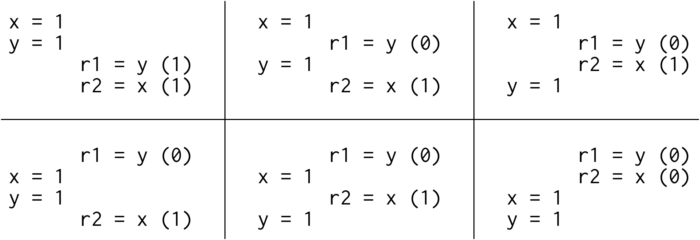
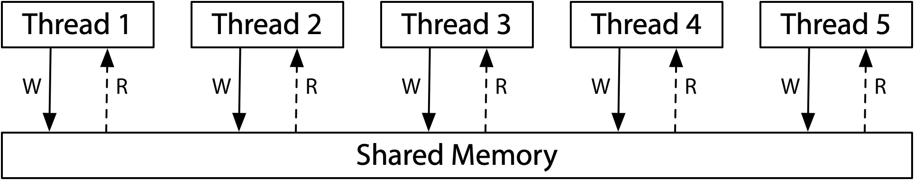

*本文译自 Russ Cox 的文章 [Hardware Memory Models](https://research.swtch.com/hwmm)。建议读者结合原文阅读。*

## 前言：童话的结局

很久以前，当每个人都在写单线程程序时，让程序运行得更快的一种方式便是啥也不管。因为下一代硬件和编译器总是能让程序在保持正确性的同时运行得更快。在这段童话般的时期，很容易就能校验优化是否有效：如果程序员不能指出程序在优化前和优化后的区别（除了速度提升），那么这个优化就是有效的。也就是说，*有效的优化并不会改变程序的行为。*

直到有一天，硬件工程师让单核处理器运行得越来越快的魔法（摩尔定律）失效啦。他们转而开始创造多核处理器，而操作系统则将这种硬件上的并行性抽象为线程暴露给程序员们。这种由多核组成操作系统线程的魔法对硬件工程师们非常友好，但是却给编程语言设计者、编译器开发人员和程序员们制造了难题。

许多在硬件和编译器层面针对单线程程序不可见的（因此是有效的）优化在多线程程序中都发生了可见的改变。这时如果一个有效的优化并没有改变程序的行为，那要么是这些优化变得无效了，要么是这个程序写的有问题。所以我们该如何区分这两种场景呢？

这里有一个 C 语言风格的简单示例。在本文中，我们默认所有变量的初始值都为 0。

```c
// Thread 1      // Thread 2
x = 1;           while(done == 0) { /* loop */ }
done = 1;        print(x);
```

如果 Thread 1 和 Thread 2 运行在不同的核心上，当二者都运行结束时会输出 0 嘛？

其实这取决于硬件和编译器。如果我们将其逐行翻译为汇编并运行在 x86 多核处理器上，那么总是会输出 1 的。但是如果运行在 ARM 或者 POWER 多核处理器上就有可能输出 0。此外不管潜在的硬件是什么，标准的编译器优化都可能导致这段程序输出 0 或者陷入无限循环。

这当然不是我们期望看到的结果。程序员们需要确切地知道一个程序能否使用新的硬件和编译器运行。而硬件设计者和编译器开发人员也需要确切地知道硬件和编译器应该如何精确地表达出这个程序的行为。这里的主要问题是内存数据的可见性和一致性发生了改变，我们可以将涉及的概念叫做内存一致性模型或者简称为*内存模型*。

最开始，内存模型的目标是定义在硬件层面应该为汇编程序员提供哪些正确性保证。在这种设定下，并没有编译器什么事。然后在 25 年前，人们开始尝试定义高级语言如 Java 和 C++ 的内存模型应该为程序员们提供哪些正确性保证。由于在模型中引入了编译器，所以定义一个合理的内存模型的工作变得相当复杂。

这篇文章是关于硬件内存模型和编程语言内存模型的第一部分。我的目标是通过构建相关的背景以引出我们想对 Go 语言内存模型做出潜在改进的讨论。但是想要搞清楚目前 Go 语言的内存模型是怎样的，以及之后会发展成什么样，我们需要首先了解目前的硬件内存模型和其他编程语言的内存模型是怎样的，以及它们是如何发展成这样的。

再次强调一下，这篇文章是关于硬件的。所以请假设我们正在为多核处理器编写汇编代码。那么在硬件层面应该为程序员们提供哪些正确性保证呢？计算机科学家们早在 40 多年前就一直在为这个问题寻找答案。

## 顺序一致性

在 Leslie Lamport 1979 年发表的论文 [How to Make a Multiprocessor Computer That Correctly Executes Multiprocess Programs](https://www.microsoft.com/en-us/research/publication/make-multiprocessor-computer-correctly-executes-multiprocess-programs/) 中就有对顺序一致性概念的介绍：

> 为这样一种计算机设计和证明多进程算法的正确性的常见做法是假定它们满足这样的条件：任意次执行的结果都是一样的，就好像所有核心的操作都在按照某种序列执行；并且每个核心的操作出现在序列中的顺序都是由程序指定的。对于这样的多核处理器，我们便称之为满足顺序一致性。

时至今日，我们不仅是在讨论硬件而且也在讨论编程语言应该如何保证顺序一致性，即如何将程序唯一可能的执行结果与将线程操作交织成顺序执行的某种方式相对应。顺序一致性通常被认为是理想中的模型，而这也是最符合程序员思维方式的模型。它可以让你假定程序正如它被编写的顺序那样执行，并且每个独立线程也会被按照某种方式交织成顺序执行。

关于顺序一致性是否是理想中的模型当然是值得商榷的，但这已经超出了本文的讨论范围。接下来我只会提及所有可能需要考虑多线程交织的场景，如今仍然和 1979 年一样，设计和证明多进程算法的正确性的常见做法在过去 40 多年中并没有什么改变。

之前我问到这个程序是否会输出 0，

```c
// Thread 1      // Thread 2
x = 1;           while(done == 0) { /* loop */ }
done = 1;        print(x);
```

为了简化分析，让我们把循环和打印去掉，看看读取这些共享变量时都有哪些可能性：

```c
// 测试: 消息传递
// 这个程序是否会出现 r1 = 1, r2 = 0?

// Thread 1        // Thread 2
x = 1;             r1 = y;
y = 1;             r2 = x;
```

让我们假设每个示例的共享变量的初始值都为 0。由于我们是在尝试确定硬件允许做什么，所以这里我们假设每个线程都是运行在它们自己声明的处理器上，而没有受到编译器指令重排的影响：即列表中的指令就是在处理器上运行的指令。$rN$表示这是一个线程局部变量而不是共享变量，并且我们需要确定当执行结束时，这些线程局部变量是否可能存在特殊的设置。

像这类关于示例程序的执行结果的问题被称为*石蕊测试*。因为它具备二极管式的回答 — 这是可能的吗？— 石蕊测试给我们提供了一种区分内存模型的方式：如果一个模型允许一种特殊的执行方式而另一种模型不允许，那这两种模型显然是不同的。但很不幸的是，我们随后就会看到，针对特定模型的石蕊测试的答案经常出人意料。

如果是在测试顺序一致性，那么此时仅仅可能存在六种执行顺序：



由于没有一种执行顺序是以 `r1 = 1, r2 = 0` 结束的，所以这种结果不存在。也就是说，在顺序一致性的硬件上，对于这种测试 — 程序可能看到 `r1 = 1, r2 = 0` 吗？— 回答是*不*。

关于顺序一致性模型一种比较好的想象是所有处理器都直接连接到同一块共享内存上，这块内存同一时刻只允许一个线程进行读写操作。由于不涉及缓存，所以每次一个处理器需要读写内存时，这个请求都会被发送到这块内存上。这种同一时刻只允许一次操作的共享内存限制了所有内存访问操作都必须顺序执行：即顺序一致性。



（本文中贴出的三种内存模型的示意图图均取自 Maranget 等人的文章 [A Tutorial Introduction to the ARM and POWER Relaxed Memory Models](https://www.cl.cam.ac.uk/~pes20/ppc-supplemental/test7.pdf)）

上图就是一种顺序一致性机器的模型，但不是唯一一种。TODO
