*本文译自桥水基金的文章 [Our Thoughts on Bitcoin](https://www.bridgewater.com/research-and-insights/our-thoughts-on-bitcoin)。原文发表于 2021.01.28，彼时比特币的价格约为 \$30000；而截止到笔者开始翻译时，价格约为 \$56000。建议读者结合原文阅读。*

## 我对比特币的思考

**—— Ray Dalio**

**我写这篇文章的目的是澄清我对比特币的看法。请关注我在这里说的内容，而不是关注那些媒体说我说了什么，因为这里更加可靠。我发现那些试图推广比特币的人（也就是大多数人）总是赋予其一种意义，而那些反对比特币的人（那些对比特币感到恐惧的人）则赋予其另一种意义。正如我评论过的大多数事物一样，现实是复杂的，有优点也有缺点，而我则尝试尽可能准确地传达我对比特币的理解。**

重申一下，我并不是比特币或者数字货币的专家，我的观点并不具备足够的参考价值，所以我其实并不应该将其发表出来。我知道一个人如果要发表有足够参考价值的观点需要多少知识储备，所以我不会打赌我的观点一定是对的。不过人们仍然想知道我对比特币非专业性的评估，所以我在这里把话说清楚总比被那些媒体扭曲的好，之前在媒体上已经存在的言论就不要关注了。我对读者的唯一要求就是，请阅读我在这里撰写的内容，而不是关注媒体上的噪声。

我相信比特币是一个了不起的发明。这种新型货币诞生于计算机领域，已经运行了十余年，并且作为一种货币和资产保值的手段仍在迅速增长，非常了不起。这就像创建了现有的基于信用的货币体系一样，如同炼金术般无中生有；这就像 1350 年左右从美第奇家族（Medicis）开始的使得银行家发财的信贷一样，使其发明者（中本聪）和早期参与其中的人变得非常富有，也可能使更多人也变得非常富有，同时也会扰乱现有的货币体系。

目前并没有多少黄金的替代方案，而人们的需求却在不断增长（因为世界正在不断地印钱和创造债务）。除了对供应有限的货币和资产保值的需求在不断增长，人们对于可以私人持有的资产的需求也在日益增长。由于像黄金一样可以保值的且可以私人持有的资产并不多，且通常这类资产的市场规模也比较小，于是便给了比特币和它的竞争者们（比如以太坊）可乘之机。在我看来，比特币和它的竞争者们似乎已经跨过了作为一种高度投机的想法（这种想法很可能在短期内就灭亡）的阶段，并且在未来可能会具备某些价值。对我来说，最重要的问题是比特币可以用来做什么，及其需求量有多少。由于比特币的供应量是已知的（总共 2100 万枚），我们可以通过估算其需求量来估算其价格。

这里我需要澄清一下供应量的问题。虽然比特币的供应量是有限的，但是数字货币的供应量却不是有限的，因为总有新的数字货币产生，所以比特币这类资产的供应量将会在这种竞争关系中扮演着定价角色。事实上我认为会有更好的数字货币出现，从而取代比特币，因为事物总是在不断进化的，新的做事方式、新的事物总会取代旧的做事方式和旧的事物。由于比特币的工作方式是固定的，所以我假定会有更好的替代方案出现。我认为这是一种风险。因此对于「有限供应」的争论并不能成真，黑莓手机就算限制了供应量也不值那么多钱了，因为它被新的更先进的竞争者替代了。我不知道如何否定这种风险，所以欢迎指正我的幼稚（naïveté）。

同时我也对比特币在这十余年当中经受住了考验而感到钦佩，这项技术运行得是如此之好，就连黑客也无可奈何。不过在当前这种网络犯罪势力比防御势力大得多的时代，对于那些持有数字货币资产的人来说，赛博（cyber）风险也是一种风险，这种风险也是我无法忽视的。当国防部（指美国）的系统都不能免受黑客攻击时，就不要天真地认为数字货币资产可以免受攻击了，这（指免受攻击）是黄金类资产的优势之一，也是所有金融类资产的风险之一。事实上，我认为将来有机会看到由多种数字货币构成的金融系统，会比现在认为的更容易受到攻击和破坏。顺便说一下，类似的事正在以越来越快的速度发生，并可能威胁到传统金融资产的价值。我已经指出了这种风险，相不相信是你自己的事。尽管我知道比特币可以被存储在「冷钱包」中，但我知道其实很少有人这样做。总的来说，比特币对于赛博风险的防范并不令我满意。关于这点我也希望得到指正。

比特币 [^1] 作为数字货币的另一类问题是，它的私密性如何，会不会受到政府的监管。请无视掉比特币的私密性，它不会像一些人认为的那样私密。毕竟比特币使用的是公共账本，并且大量的比特币是以非私人方式持有的。如果政府（或者黑客）想要查看谁是谁，我很怀疑比特币能提供有效的保护。并且在我看来，如果政府想要禁止使用比特币，那么人们对于它的需求将会大大降低。在我看来，政府会侵犯隐私或禁止使用比特币（及其竞争者）并不牵强，比特币越是成功，这种可能性就越大。从成立第一个央行（英格兰银行，1694 年）开始，出于合乎逻辑的理由，政府希望控制货币，并且保护他们作为其境内唯一提供货币和信贷的能力。当我将自己置于政府的立场，审视他们的行为，并且倾听他们都说了些什么，我很难想象他们会允许比特币（或者黄金）成为比他们提供的货币和信贷更好的选择。我认为比特币最大的风险便是它的成功，正是因为它的成功，政府会将其封杀，并且他们也有实力这么做。

就供需场景而言，尽管比特币的供应量是已知的，但其长期需求在相当长的一段时间内（如果要作为一种长期资产）是很难知道的，主要原因便是我上面提到的这些。当我将比特币视作类似黄金的替代资产时，我便要求 Rebecca Patterson 和其他桥水基金的同事们做一些计算，假如从私人持有的黄金总量中抽出一定比率的黄金，假定这些黄金都被转移到了比特币以分散风险，会发生什么。假如 10% 或 20% 或 30% 或 40% 或 50% 的私人持有的黄金被转移到了比特币，假如 10% 或 20% 的比特币持有者想要将其置换成黄金或者股票等资产，假如政府打算禁止使用比特币，假如 …… 假如这些事情发生了，会是什么样子的？最终他们描绘出了充满不确定性的蓝图（参见下文）。<u>这就是为什么我将比特币视作一种长期的充满不确定性的期权的原因，我可以在其中投入一定的资金，我也不介意亏掉其中的 80%。</u>

这就是我对比特币非专业性的评估了。我还是非常渴望能了解得更多的。另一方面，相信我，我和我在桥水基金的同事们正密切关注着各种资产保值的替代方案。

[^1]: 当我说「比特币」时，请注意我说的是比特币和它的同类竞争者们。

## 一种关于比特币是否会成为资产保值的替代物的视角

**—— Rebecca Patterson, Dina Tsarapkina, Ross Tan, Khia Kurtenbach**

世界上大部分央行都在使其货币贬值，债券收益率已经趋近于零，是时候寻找资产保值的替代物了。比特币作为数字货币的先驱者，随着其价格的飙升而备受关注 —— 自从去年十月份以来，比特币的价格上涨了约 200%，甚至达到了 \$40000 以上，目前稳定在了 \$30000 左右。比特币有一些吸引人的地方，比如限制供应量和全球可交易，并且还在迅速发展。不过就目前而言，我们并不认为它是大型机构投资者可行的存储财富的方式，主要是因为其较高的波动性、监管的不确定性和交易门槛。我们更愿意将其看作是在购买潜在的「数字黄金」的期权 —— 它有很多发展种方向，而其中一种可以使得它成为真正的机构投资者存储财富的方式。

当我们审视比特币时，我们相信它具备某些（但不是全部）成为保值资产的特质。比特币的优点和黄金类似，它不会因为央行印钞而贬值，并且其供应量是有限的。并且它可以很方便地在全球范围内进行交易，尤其是对于个人来说。它还具备多元化的潜力，尽管到目前为止，这更多还是理论上的可能性。

与此同时，比特币仍然面临着一些挑战，至少目前还是会影响到机构投资者广泛使用之。我们要特别强调如下三点：

- 比特币仍然是一种具有极高波动性的资产，并且其未来的购买力从根本上来说仍然是一个投机命题。相比于已有的资产保值方式，比如黄金、房地产或者可以避险的法定货币，在未来比特币的价值仍然有着非常高的不确定性。
- 比特币仍然面临着监管的尾部风险（tail risks），并且缺乏任何一个潜在的政府背书，也缺少深厚的历史底蕴，而这些都将影响到其未来的基本需求量。
- 尽管有所改善，但因为目前比特币的流动性水平，持有比特币仍然会对大型传统机构（比如桥水基金及其客户们）构成结构性挑战。

展望未来，我们有理由期待比特币以及其他数字货币的基础设置会变得越来越完善。此外，在当前这种政府债券不再提具有相同回报率或多元化特点的时代，货币正面临着越来越大的贬值风险，这可能会（比其他情况）更快地促进资产保值的替代物的发展。不过我们仍然对比特币的前景保持中立态度，因为有许多因素都会影响到比特币的未来 —— 至少在目前，我们还不能很自信地预测未来。

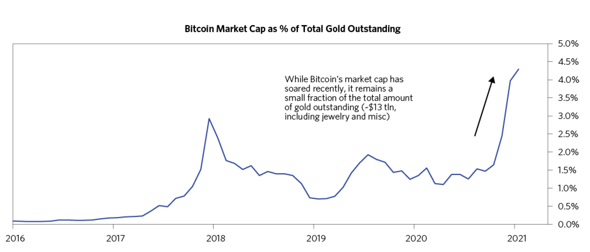

这篇调研报告的余下部分将围绕以下三个角度对比特币进行考量：

- 它在数字货币中的地位以及推动其最近上涨的因素，
- 支撑比特币成为保值资产的因素，以及
- 关于比特币未来需要面对的问题和挑战。

这其中有非常多的细节。对于那些只想了解重点的人，我们建议只阅读粗体字和配图。

### 比特币的大幅度反弹重新引发了其作为保值资产的可行性的讨论

比特币在 2020 年的价格激增了 400%，这再次引发了人们的关注，这很大程度上得益于人们认为比特币可能会成为「数字黄金」—— 一种资产保值的替代物，以及潜在的对抗通胀的投资组合。尽管目前市面上存在多种数字货币，但我们仍然在关注比特币，因为它在潜在的「数字黄金」的讨论中占据着主导地位。

在 2017 年那次牛市中，尽管比特币仍然享有大量的投机注意力，但它的回报率较低，所以其在整个数字货币市场的份额急剧下降，因为整个市场的注意力正被一股 ICO（首次代币发行）浪潮席卷。投机者们买入新型公司提供的新的数字货币代币，这些公司承诺将提供新的去中心化技术以及新的商业模式。作为对比，在 2019 年到 2020 年末的行情中，比特币跑赢了数字货币的大盘，其市场份额已经回到了 2017 年初以来的最高位置。根据我们与数字货币市场的领先参与者以及服务商的访谈，人们对于比特币是「数字黄金」的观点越来越感兴趣，这似乎是推动这一轮上涨趋势的关键因素。

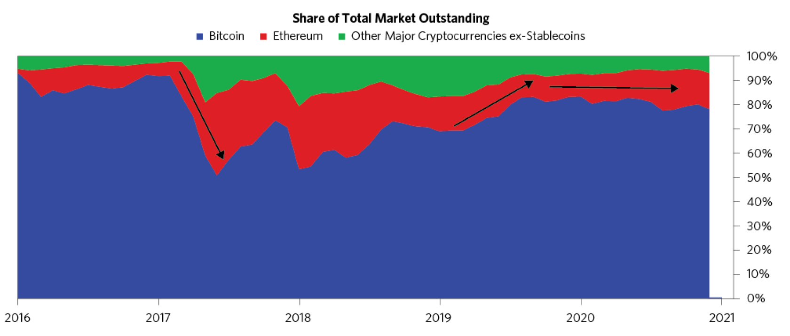

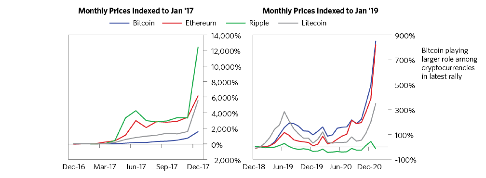

### 比特币有限供应的特点使其在央行激进印钞的时候特别有吸引力

**与黄金类似，比特币作为直接交换商品和服务的媒介，用途有限。但也像黄金一样，比特币稳定且限制了发行量，不会因为央行印钞而贬值。**比特币的总供应量被硬编码限制为 2100 万枚，并且每隔几年其供应量会自动减半。这便是比特币作为「数字黄金」的叙事模式。如下图所示，虽然比特币头几年的发行量较高，但现在其发行速度却比黄金低得多。

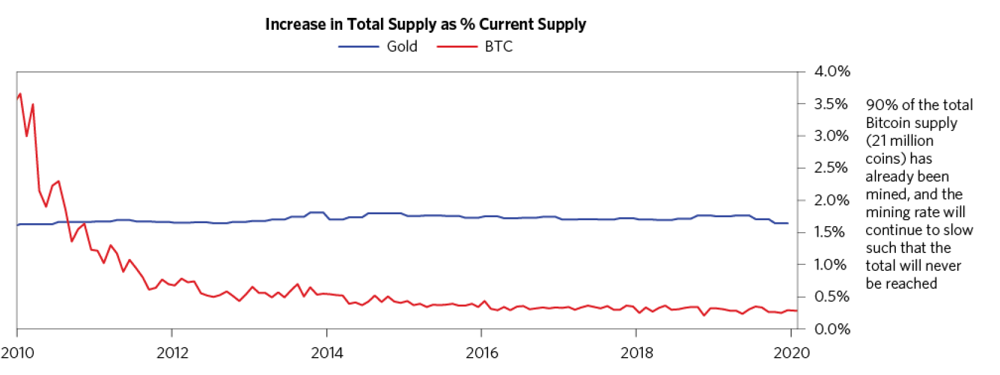

**比特币现在看起来对某些投资者非常有吸引力，原因与过去几年黄金得到支持的原因一样。黄金和比特币都不具备通过支付就能取得的收益，但这在其他资产的收益率已经崩溃的情况下并不重要。**并且黄金是为数不多的能在滞涨中表现良好的资产之一，这种情况（指滞涨）很可能发生，而我们必须有所规划。此外，在国家内部和外部冲突日益升级的情况下，持有黄金的好处是不会受制于任何一个国家（的经济和政策）。假如人们完全接受了比特币是「数字黄金」的设定，你完全可以想象类似的情况会在比特币身上再次发生。

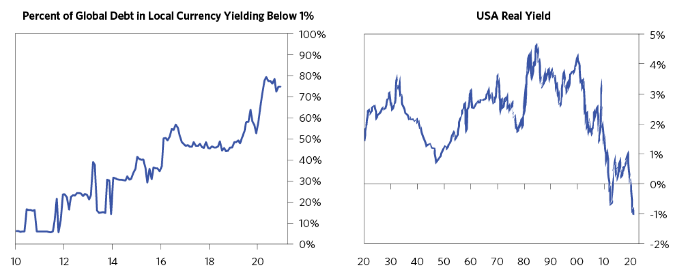

### 比特币是一种便携的且在全球范围内都可以使用的资产存储方式

当然，仅仅有稀缺性并不意味着比特币可以满足人们对资产的需求，并维持其作为一种可行的保值手段。并且其他具备类似特征的数字货币从概念上讲也有可能成为「数字黄金」。但至少目前为止，比特币具有更长的历史、更大的规模以及更广泛的共识，这些都是比特币的优势所在。举个例子，比特币显然跑赢了比特币现金、莱特币和门罗币 —— 其他主流数字货币的技术特点与比特币类似，都只有有限的供应量，并且都强调「健全货币」的理念。稳定币的需求也出现了强劲的增长，稳定币是中心化资产抵押发行的代币，通常与美元挂钩。但是稳定币天然是用于抵押的，并不能真正作为资产保值的替代方案 —— 它只是数字货币的一种新形式。

**最后，除了要具备能经受得住时间的考验的购买力以外，一个好的资产存储方式还需要具备易于交易和使用的属性（不论是现在还是将来）。与一些传统的保值资产如黄金、艺术品和房地产相比，比特币的交易确实更加便利，尤其是对于个人持有者来说。同时，比特币天然的数字属性也可能使得它会成为最便利的资产存储方式，即使是与现金相比。**而且，就其地理范围而言，随着比特币兑换服务的全球扩散，你可以在世界大多数地方相对容易地兑现比特币，尽管将美元转换成当地货币仍然要容易得多（除了外汇管制）。

### 我们尚不清楚比特币能否提供投资组合所需的多元化

**比特币的历史仅有十余年，目前还没有确切的证据表明它可以像黄金一样能在未来提供投资组合所需的稳定可靠的多元化。**也就是说，我们仍然需要更多数据来了解比特币是否既可以被用来对抗通胀，同时又能抵消投资组合的缩水。如下图所示，在今年，随着通胀预期的上升，比特币的价格也随之上升，但它与通货膨胀和黄金的长期历史关系相对较弱。

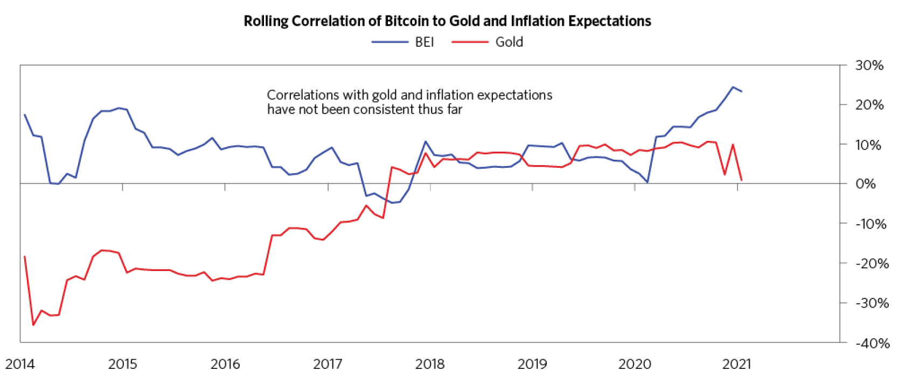

此外，下图展示了在 60/40 投资组合遭遇缩水的时期，黄金是如何支撑可靠的回报的。我们对比特币的表现适当缩放，以叠加自 2009 年以来的相似的资产缩水期。考虑到数字货币世界的发展速度，我们并不能通过如此小的样本量得出任何确定性的结论。**至少到目前为止，比特币提供的某些多元化收益的能力看上去仅具备理论上的可行性。**

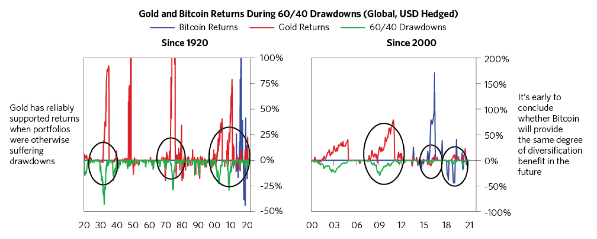

### 比特币的机构接受程度受到其波动性、监管的不确定性及其不完善的基础设施的影响

**如果资产保值的基本理念是保持或增加一个人的购买力，那么我们认为比特币更像是一种期权 —— 它仍是高波动高投机的资产。与现有的保值资产相比，比特币尚未被广泛用作储蓄工具或储备资产，而没有政府或者大型机构投资者的参与是没有意义的。**尽管最近私人投资者的数量有所增加，大部分人似乎仍在使用比特币进行短线投机，而不是将其作为长期的储蓄工具。

尽管很难获得准确的数据，但下图还是展示了用于储蓄的比特币份额的两种指标；即比特币占用的累积账户（accumulation accounts）份额，这些账户的存在时间均超过了 5 年。累积账户指的是仅有买入比特币操作而没有任何卖出操作的账户，而「最后活跃」的比特币数量则同时包含了长期投资者持有的比特币数量和已经被丢失的比特币数量。可以看到，自从 2018 年以来，尽管长期投资者的数量有所增加，但他们占有的份额还相对较小（~15%）。尽管相当一部分的比特币在过去五年多的时间里都没有被动过（>20%），但大部分已经被挖出的比特币仍处于活跃或半活跃的状态（这暗示了存在更多的投机交易）。

我们估算比特币持有量的另一种方式是（不论是出于投机目的还是保值目的）看换手率。比特币的换手率比黄金要高得多，这也体现出了它具有更强的投机性。与比特币相比，黄金的换手率占其总流通量要低得多，部分原因是世界各地的央行持有大量黄金作为其储备金。另一方面，近年来比特币的交易量呈现出爆炸式的增长，这主要归功于高频交易者的入场、区块链衍生品市场的蓬勃发展，以及大量可以和比特币兑换的新币的出现。再加上没有受到监管的交易所提供的有问题的数据，形成了流动性增加的假象。这种流动性反映的是高换手率和高度投机，而不是在抵御长期风险。

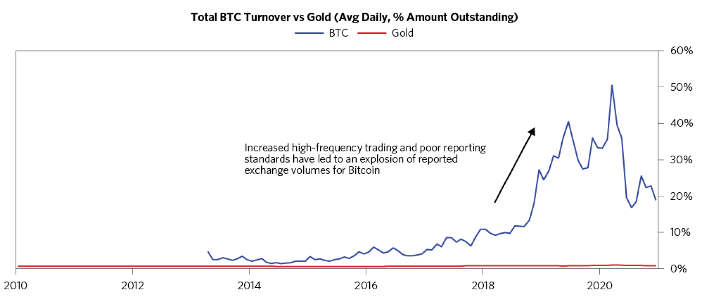

并且近期比特币的投机热潮已经展现出了一些资产泡沫的经典特征。例如比特币的期权定价呈现出人们对其未来的高度乐观心态。正如我们在之前的研究报告中写到的那样，对其未来价格快速升值的贴现是典型的泡沫行为，这也进一步说明了比特币市场仍然具有高度投机性。不过，尽管目前的这轮反弹已经呈现出了少量泡沫的特征，例如过高的杠杆和小额度买入（这是 2017 年数字货币泡沫的特征），散户们买入比特币的兴趣（retail interest）仍然在飙升。主流交易平台保证金利率的提升也表明人们正在加速通过杠杆买入比特币。对未来价格快速升值的强烈贴现，广泛的看涨情绪，以及不断上升的杠杆，都是泡沫风险的特征，不过正如我们以前写过的那样，泡沫可能会持续很长一段时间。

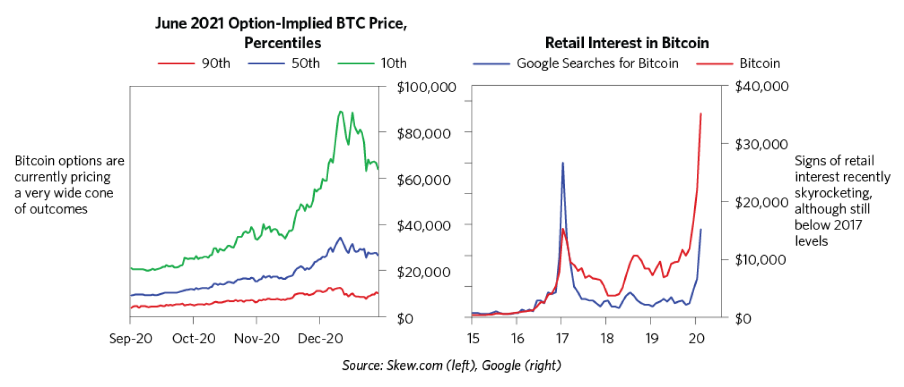

以上所有因素导致比特币的价格波动明显高于其他风险性金融资产，例如股票或者大宗商品，更不用说和传统的黄金等保值资产相比了。在比特币短暂的历史中，大部分比特币都是亏本持有的。虽然也有一段时间大部分比特币都处于盈利状态（例如今天这种情况），但是对于保值资产而言，降低贬值风险比拥有投机性的升值潜力要重要得多。所以这也反映了如今比特币类似期权的特点。

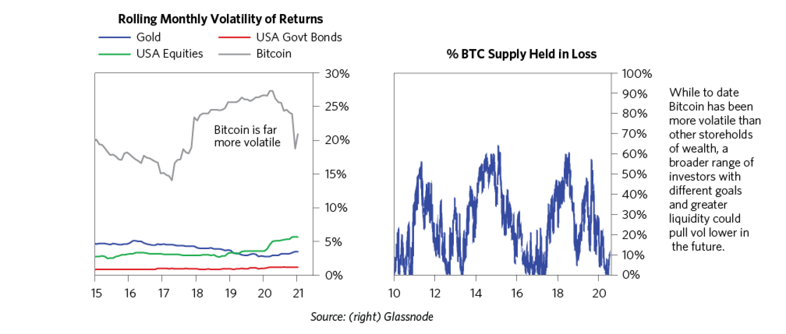

尽管比特币自诞生以来的波动率比大多数人认为的已有的保值资产的波动率要高，但我们认为这可能会随着时间的推移而发生质变。正如我们在其他市场的发展过程中所看到的那样，随着越来越多不同类型的投资者（长线或短线）的参与，可能会使波动率降低。

### 比特币可能受到监管的不确定性会产生双向风险

**也许最重要的是，比特币能否被大型机构投资者接受取决于其是否会受到监管。**政府是否会创造一种监管环境，使得人们更青睐某些资产而忽视另一些资产？政府是否会禁用比特币？尽管我们不知道事态会如何发展，但我们知道政府正愈加关注此事，而结果的可能性很多。

就在这个月，欧洲央行行长 Christine Lagarde 在谈到比特币时就说到：

**「这是一种高度投机的资产，它可以被用于开展一些有趣的业务，也可以被用于可耻地洗钱 …… 必须制定一种法规（去管理它）…… 我们必须在全球范围内达成一致，否则只要有一个例外，这个例外就会被利用。」**

同样地，Janet Yellen 在一月中旬的美国财政部部长听证会上也表达了「数字货币需要被特别关注」的观点，当她提到恐怖主义的融资途径时说到「我们确实需要研究如何减少它（数字货币）的使用，从而避免人们利用它洗钱」。

**我们认为有两种可能的监管方向可能会在未来几年内到来，分别是：**

- **对比特币和其他数字货币进行打压，从而切断了这种资产的进一步发展，原因是政府担心它们会损害现有的法币，或者**
- **创造一种监管环境，使得人们在长期内对这种资产更有信心，但这一过程会导致波动加剧。**

**无论是哪个方向，我们都认为这会导致比特币的过山车行情持续一段时间。**

我们可以通过对数字货币限制更加严格的中国一窥究竟。2017 年 9 月，中国政府禁止了 ICO（首次代币发行）并称其为非法行为，导致比特币价格瞬间下跌 8%。类似的禁令在美国不太可能出现，但存在技术上的可行性。鉴于大多数比特币交易者使用电汇或借记的方式进行交易所入金，美国政府其实可以通过管制法币的使用目的，使得美国投资者们无法购买比特币。而我们的关注点在于，如果未来央行发行了大量的数字货币，政府可能更愿意通过限制比特币的方式来避免其作为非官方数字货币替代方案（与官方方案竞争）。

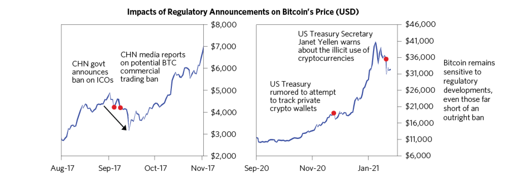

即使是在大家公认的不太可能全面禁止的前提下，许多潜在的监管仍然可能会对比特币的接受度和市值造成实质性的损害。在过去几年，美国整体的监管方向对于数字货币和区块链技术的接受程度越来越高，这些领域被认为是没有威胁且易于监管的；但是对于被认为是支持非法活动和颠覆现有监管结构的领域的打击力度也越来越大。

作为上述动态过程的补充，美国货币总稽核办公室最近宣布，美国的银行可以使用区块链和稳定币进行支付。作为对比，一个月以前，美国财政部提出的一个条例阻碍了可自托管的（self-hosted）数字货币钱包的使用，这有效禁止了门罗币和 Zcash 等「隐私币」的使用。

除了比特币和数字货币世界激增的不受监管的「狂野西部」景观，还存在其他领域面临破坏性监管的风险。其中最引人注目的便是目前最大的稳定币 Tether（USDT）的地位。Tether 目前正在接受 CFTC、美国司法部和纽约州检察官的调查，因为它最近新发行了价值数十亿美元的 USDT，而这些 USDT 可能没有像它声称的那样有对应美元的支撑。如果 Tether 被关闭或遭受其他重大的监管处罚，考虑到整个数字货币市场的流动性联系，可能会使包括比特币在内的所有数字货币的价格崩溃。

第二种可能的监管方向将允许更多出于规避风险目的投资比特币的机构入场，但头部的比特币持有者仍可能造成巨大的波动，这些人很多是比特币的早期使用者，且认同比特币创始人中本聪（Satoshi Nakamoto）的加密无政府主义（crypto-anarchic）。因此，围绕美国财政部提出的自托管钱包条例引发的最初猜测，引发了有意义的比特币抛售。

不过从长远来看，监控还是可以创造一些值得考虑的上行空间的。与 2017 年的牛市相比，这次的效率更高，市场流动性、交易基础设施和托管解决方案更先进，这使得更多的机构投资者参与其中。我们认为部分原因要归功于监管方面的变化，如传统交易所接受比特币衍生品。

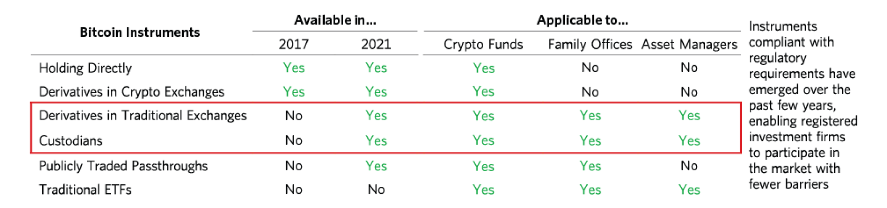

由此导致的结果是，近期流入比特币的资金是由更大的交易规模驱动的，而不是 2017 年那样是由散户驱动的。但值得注意的是，目前主要参与的机构投资者集中在小公司、对冲基金和家族基金，而不是更大的、传统的机构投资者，且相关投资工具的市场规模仍然很小。

**最好的情况是，数字货币市场监管的成熟保证了更多围绕比特币投资的手段（例如比特币 ETF），大型机构投资者得以增加他们的风险投资。**我们想要知道这种情况下比特币会变成什么样子 —— 例如投资者会不会将其持有的部分黄金转移到数字货币中。我们在下面的图表简单估算了（只是为了说明问题）如果有一定数量的私人黄金储蓄（不包括央行）分散到比特币中时比特币的价格。在表格的最下面一行，我们甚至假设比特币和私人持有的黄金储蓄的总市值的一半被分配到了比特币。总的来说，分配到所有已经被挖出的比特币上大概是 1.6 万亿美元。这种从黄金转移到比特币的多元化，理论上可以使比特币价格至少再提高 160%。

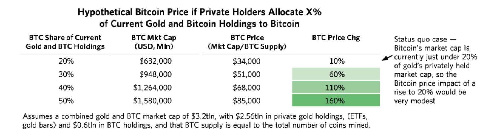

**当然，这种计算的前提是不存在流动性或反身性的问题。在现实中，上述估算可能会被证明是保守的，因为这种规模的流动可能导致供应紧张（squeeze）和自反（reflexivity），从而推动比特币的实际价格涨的更高。**注意，这里只是为了表明存在这种可能性，而不是什么具体的预测。显然我们还没有考虑到更多影响比特币价格的因素。例如我们不知道央行会在什么时候考虑将他们的黄金转移到比特币上，也不知道那时监管部门会如何干预比特币的价格。

### 希望持有比特币的大型机构在其投资结构和操作问题上仍然面临挑战

**除了未来潜在的监管风险，比特币在被更广泛的使用方面也受到了挑战，因为其操作方式缺乏足够的监管清晰度，且其未来的弹性（resiliency）也存在疑问。**对于前者，我们不会深入细节，只是举个例子，机构通常都有不同程度上且更高的保管要求；而比特币是一种不记名资产（其所有权归属于私钥持有者），这增加了机构资产管理者对其安全保障方面的顾虑。与传统股票相比，数字资产的托管费用仍然较高，且监管机构仍在制定保管人的合格规则，而且目前为托管数字资产提供保险的承销商市场有限。当然这也意味着越来越多的机构级托管方案正在慢慢出台，而且其服务和定价可能会随着越来越多的需求而继续发展。

**大型机构如果想要在它们的投资组合中添加比特币的话，也需要足够的流动性，这样在进行大规模交易时才不会破坏市场的稳定性。虽然比特币已经可以与桥水基金正在交易的一些市场相提并论，且其流动性也达到了历史高点，但它的总体规模仍然很小。**下面的图表中列举了一些对比的例子。对于那些可以直接交易数字货币的投资者来说，根据我们对流动性的评估，其总体规模大约为可交易的黄金的市场规模的 10%。而对于那些只能或期望通过传统方式（例如金融衍生品、股票等）方式进行比特币投资的大型资产管理机构来说，市场规模更小了。

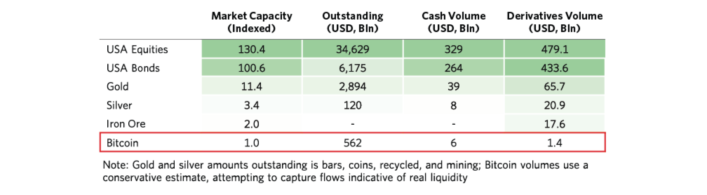

下面的图片展示了从我们的可信渠道获取的比特币交易量，我们相信这表明了比特币的真实流动性。可以看到，尽管交易量（金额）呈现爆炸式增长，但换手率变化不大。鉴于这种趋势，同时考虑到比特币有限的供应量以及小规模（尽管在增长）的期权市场，目前比特币的流动性更像是其价格的函数。尽管它（指比特币的流动性）最近有所增长，但就其目前的规模而言，部分投资者在其资产配置上的小幅度变化就可能对比特币市场产生很大的影响。当然黄金也是一样的，尽管黄金市场的规模超过了比特币，但黄金也只是美国股市规模的一小部分。

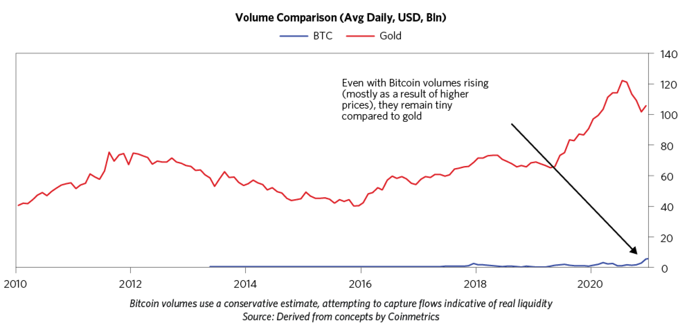

总而言之，比特币自身的特点可以使其成为一种有吸引力的资产存储的替代物；到目前为止，它也是被证明是具有弹性的。但我们必须承认，这种金融工具只有十余年历史。相比于黄金等已经存在的保值资产，比特币这种数字资产在未来将如何发展？未来的挑战可能仍然来自量子计算、监管甚至我们未知的问题。即使目前还没有遇到这些问题，但就目前而言，比特币对我们来说更像是一种资产保值的替代物的期权。
