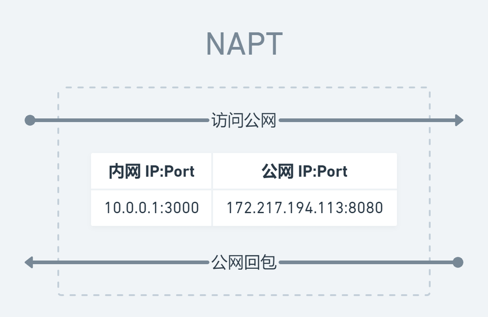

*最新内容和勘误请参见笔者撰写的线上书籍[《WebRTC 学习指南》](https://webrtc.mthli.com/)。*

WebRTC 本身是基于点对点（Peer-to-Peer）连接的。如果连接双方都是公网地址，则可以直接访问到对方，从而建立连接。但大部分情况下其中一方或者双方都不是公网地址，而是隐藏在 NAT（Network Address Translation，网络地址转换）之后的内网地址，此时要建立连接，就得使用某种能绕过 NAT 的打洞技术。

## NAT

在开始介绍打洞技术之前，我们先了解一下 NAT。NAT 全称 Network Address Translation，即网络地址转换，可以理解为公网地址和内网地址的映射规则。NAT 通常是个**路由器**，且最早是作为 iPv4 地址短缺的一种解决方案而流行起来的。

以常见的基于地址和端口转换的 NAPT 为例。如下图所示，假设有台路由器的公网地址为 `172.217.194.113` ；此时内网有台地址为 `10.0.0.1` 的设备想要访问公网服务器，则：

1. `10.0.0.1` 这台设备上端口为 3000 的程序发出源地址为 `10.0.0.1:3000` 的 IP 数据包。
2. IP 数据包经过路由器时，路由器对其源地址进行查表；如果源地址不在表中，便会自动分配一个端口号给它，图中对应的端口号就是 8080；同时其内网 IP 也会被替换为公网 IP。
3. IP 数据包经过路由器后，源地址变为 `172.217.194.113:8080` ，而目标地址不变。

于是 `10.0.0.1` 这台设备便可以访问公网服务器了。同理，当公网服务器回包时，路由器会进行反向查表，将请求结果转发给 `10.0.0.1` 这台设备。

## 打洞流程

假设存在两台设备 A 和 B，它们分别位于各自的 NAT\_A 和 NAT\_B 之后。此时 A 第一次尝试和 B 建立点对点连接，向 NAT\_B 发送数据包；然而 NAT\_B 经过查表发现，之前并没有 A 和 B 的映射（即 A 的请求无法被转发到 B），于是来自 A 的数据包就会被丢弃。

为了能绕过 NAT 的限制，我们需要借助一台公网上的服务器 S 做地址转发。如下图所示：

1. A 与 S 建立连接（Session A-S），向 S 注册自己的内网地址 `10.0.0.1:4321` ；S 会同时记录 A 在公网的地址 `155.99.25.11:62000` 。B 与 S 建立连接（Session B-S），向 S 注册自己的内网地址 `10.1.1.3:4321` ；S 会同时记录 B 在公网的地址 `138.76.29.7:31000` 。
2. A 向 S 发送请求，获取 B 的地址（Request Connection to B）；S 会同时把 A 的地址转发给 B（Forward A's Endpoints to B）。然后 A 和 B 都开始尝试相互向对方发送数据包。
3. 当 A 向 B 第一次发送数据包时（Send to B at）会在 NAT\_A 中产生映射 `(10.0.0.1:4321, 138.76.29.7:31000)` ；此时 NAT\_B 并没有 A 和 B 的映射记录，数据包仍然会被丢弃。
4. 当 B 向 A 第一次发送数据包时（Send to A at）会在 NAT\_B 中产生映射 `(10.1.1.3:4321, 155.99.25.11:62000)` ；因为之前 NAT\_A 已经创建了 A 和 B 的映射，所以 B 请求成功。
5. 当 A 向 B 第二次发送数据包时，因为 NAT\_B 也有了 A 和 B 的映射记录，所以 A 也请求成功。于是打洞完成，A 和 B 可以直接建立点对点连接（Session A-B）。

有的读者可能会产生疑问：为什么要向 S 上报内网地址？假设存在两台设备 A1 和 A2，它们同时位于 NAT\_A 之后，且它们并不知晓各自的地址。当 A1 和 A2 通过上述步骤建立连接后，它们会发现双方都在同一内网，而所有数据包仍然需要通过 NAT\_A 转发是没有必要的，直接使用内网地址建立连接显然更快。

真实的网络情况可能会更加复杂，比如需要在多层 NAT 之间打洞。以及目前业界习惯使用 UDP 协议进行打洞，而不是 TCP 协议。若读者想要了解更多打洞细节，可以参考这篇文章：[Peer-to-Peer Communication Across Network Address Translators](https://bford.info/pub/net/p2pnat/)。
