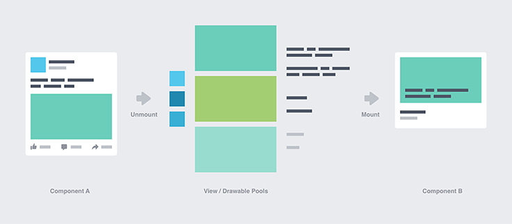

几年以前在开发 [知乎想法](http://yien.design/2018-06-zhihu-notions/) 的过程中，顺手开发了一个便于撰写 RecyclerView 卡片的脚手架 [zhihu/SugarAdapter](https://github.com/zhihu/SugarAdapter)。之所以称为「脚手架」是因为这个库除了使用 Java 注解在编译期自动生成 Adapter 的绑定代码之外，其他什么都没做。当你的卡片类型非常多的时候，你就知道手写绑定代码是多么痛苦的一件事。

卡片写多了，自然也摸索出一些优化列表加载速度的小技巧。虽然并不像其他博客那么全面，但相信也能给读者一些启发。当然另一个原因是，做了一年的全干开发，Android 方向的知识竟然渐渐遗忘了，需要重新唤醒一下。

当然 RecyclerView 自己就存在一部分优化，比如在 support v25.1.0 就默认开启了预加载机制，感兴趣的读者可以参见 Google 在 Medium 上发表的文章 [RecyclerView Prefetch](https://medium.com/google-developers/recyclerview-prefetch-c2f269075710)。

## 基本思想

性能优化的基本思想是**不要在主线程执行耗时方法**。比如在 ViewHolder 中处理数据：

```java
// 移除字符串中的 HTML 标签，但保留其中的文字
mTextView.setText(Html.fromHtml(data).toString());
```

`Html.fromHtml()` 这个方法是比较耗时的，对于不同的字符串，几毫秒到十几毫秒不等。就算一次几毫秒，几个 TextView 就是十几毫秒，会有明显的掉帧。不过我们思考一下，真的有必要在 ViewHolder 中处理数据吗？

ViewHolder 严格来说只应该做数据与视图绑定，而不应该同时做数据处理。从执行网络请求到 Adapter notify change，数据处理应该是在 notify change 之前就完成了，即数据处理应该放在执行网络请求的线程里，体验上最多就是网络刷新时间稍微长了一点。

检测耗时方法的办法很多，笔者就不与赘述了。尽量把耗时方法移动到异步线程中，列表就已经很流畅了。没有任何魔法，只需要读者重构部分代码即可。

## 切割卡片

Facebook 的声明式 UI 框架 [Components for Android](https://engineering.fb.com/android/components-for-android-a-declarative-framework-for-efficient-uis/) 提供了一种基于组件的细粒度回收复用机制。如图所示，卡片 A 中的元素可被拆解为 Avatar 组件、Image 组件和 Text 组件；当卡片 A 被移出屏幕时，这些组件会被放置到缓存对象池，可以被用来构建新的卡片 B。



如今 C4A 已经被升级为 [Litho](https://fblitho.com/) 维护。笔者并没有实际使用过 Litho，而是推荐由 Tumblr 开源的 [Graywater](https://github.com/tumblr/Graywater) 介绍的「切割卡片」的方案（当然这个方案也是源自 C4A 了）。

观察如下卡片布局，当一张卡片占用屏幕面积较大时，RecyclerView 的回收复用效率是较低的，因为卡片 #1 的 head 和卡片 #2 的 foot 并没有被展示，但却花费了额外的性能。

```text
   model       views
+---------+   +------+
|         |   | head | <------- does not exist
|         |   +------+ <------------+
| item #1 |   | body | <---+        |
|         |   +------+     |        |
|         |   | foot |     |        |
+---------+   +------+     |        |
                           screen   view hierarchy
+---------+   +------+     |        |
|         |   | head |     |        |
|         |   +------+     |        |
| item #2 |   | body | <---+        |
|         |   +------+ <------------+
|         |   | foot | <------- does not exist
+---------+   +------+
```

此时我们可以将 head、body 和 foot 拆分为不同的 ViewHolder，即一张视觉上的卡片实际上是由三种不同的 ViewHolder 拼接而成的。这便有效提升了 RecyclerView 的回收复用效率，并且创建多个小布局比单独创建一个大布局更不容易卡顿。


一般来说，一个 Model（读者也可以理解为 Data）对应一个 ViewHolder。但如果按照上述切割卡片的方案，则一个 Model 会对应多个 ViewHolder，因此开发过程中需要自己维护这种映射关系。注意，读者完全可以使用自己熟悉的 RecyclerView 框架实现这套方案，没有必要使用 Graywater（这个库在笔者看来还是太过复杂了）。

## 预解析布局

笔者刚入门 Android 时，便牢牢记住了「只能在主线程更新 UI」的规定。直到在知乎上看到了 [这个问题](https://www.zhihu.com/question/24764972)，才知道原来这只是 ViewRootImpl 的 `checkThread()` 的限制：

```java
public final class ViewRootImpl {
  ...
  void checkThread() {
    if (mThread != Thread.currentThread()) {
      // 只有创建 View 的线程可以更新它
      throw new CalledFromWrongThreadException(
        "Only the original thread that created a view hierarchy can touch its views.");
    }
  }
}
```

后来又知道了 [AsyncLayoutInflater](https://developer.android.com/reference/androidx/asynclayoutinflater/view/AsyncLayoutInflater) 这个可以在子线程解析布局的类。可前面不是说「只有创建 View 的线程可以更新它」嘛，为啥这个类在子线程解析出的布局就可以在主线程被更新呢？我们需要注意到使用 AsyncLayoutInflater 的一个限制条件为：

> NOTE that the inflated View hierarchy is NOT added to the parent. It is equivalent to calling LayoutInflater.inflate(int, ViewGroup, boolean) with attachToRoot set to false.

即 AsyncLayoutInflater 解析出的布局是不会被添加到其父布局的。以下代码展示了 View 是获取 ViewRootImpl 的方法。因为解析出的布局没有被添加到父布局，mAttachInfo 为空，不存在 ViewRootImpl，自然也谈不上 `checkThread()`。

```java
public class View {
  ...
  public ViewRootImpl getViewRootImpl() {
    if (mAttachInfo != null) {
      return mAttachInfo.mViewRootImpl;
    }
    return null;
  }
}
```

考虑到复杂卡片布局的解析耗时通常在几十甚至上百毫秒，我们完全可以在子线程里预解析好卡片布局，然后在 `onCreateViewHolder()` 调用时直接返回就可以了。不过读者完全可以自己实现预解析，没有必要使用 AsyncLayoutInflater，借鉴其思想即可。

最后，关于页面流畅度的优化，还可参见 Google 官方文档 [Slow rendering](https://developer.android.com/topic/performance/vitals/render)。以上。
