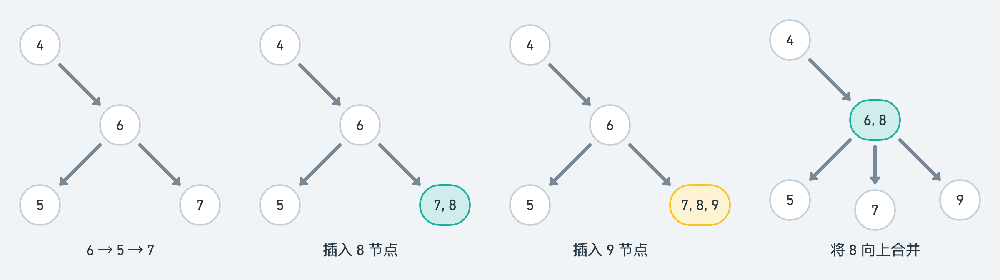
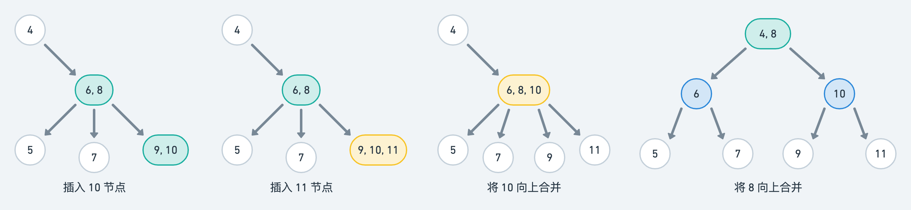
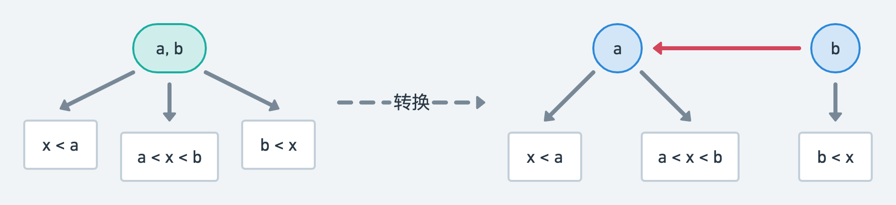

几年前笔者刚开始找实习时，曾经面过四次阿里的一面，几乎每个面试官都会问这样一个问题，如何在一亿条数据中快速查找到某条数据？笔者当时并没有回答上来，反而觉得客户端没有处理这么多数据的场景。不过现在回想起来，一种可行的方案就是红黑树了。

我们都知道红黑树既是二叉搜索树又是平衡二叉树，最坏情况下的时间复杂度为 $2\log_{2}N$，所以当 $N=100000000$ 时至多需要大约 44 次查找即可。红黑树之所以如此高效，是因为 [其定义](https://zh.wikipedia.org/wiki/%E7%BA%A2%E9%BB%91%E6%A0%91) 保证了它在最坏情况下也基本是自平衡的：

> 1. 结点是红色或黑色
> 2. 根是黑色
> 3. 所有叶子都是黑色，注意叶子是 NIL 结点
> 4. 每个红色结点必须有两个黑色的子结点，即从每个叶子到根的所有路径上不能有两个连续的红色结点
> 5. 从任一结点到其每个叶子的所有 [简单路径](https://zh.wikipedia.org/wiki/%E9%81%93%E8%B7%AF_(%E5%9B%BE%E8%AE%BA)) 都包含相同数目的黑色结点


> 这些约束确保了红黑树的关键特性：从根到叶子的最长的可能路径不多于最短的可能路径的两倍长。结果是这个树大致上是平衡的。
>
> 要知道为什么这些性质确保了这个结果，注意到性质 4 导致了路径不能有两个毗连的红色结点就足够了。最短的可能路径都是黑色结点，最长的可能路径有交替的红色和黑色结点。因为根据性质 5 所有最长的路径都有相同数目的黑色结点，这就表明了没有路径能多于任何其他路径的两倍长。

不过以上都是老生常谈了，相信大多数博客也都是这么介绍的。但都没有回答一个关键的问题，即红黑树究竟是怎样诞生的？我们一般都是通过观察结构特性来理解数据结构，但红黑树不一样的地方在于，它跳出了结构特性这种抽象的骨架，变得具体了——加上了颜色，使得理解难度瞬间上升。读者可能明白红黑树是怎样运行的，但却不一定知道它是怎样诞生的，这就有点知其然不知其所以然的嫌疑了。

笔者最近重新翻阅了《算法（第 4 版）》，发现书中介绍了一种名为「2-3 平衡树」的数据结构，这种数据结构符合我们对数据结构的一贯认知——没有任何颜色，并且与红黑树完美等价，非常容易理解。事实上该书的作者 [Sedgewick](https://www.cs.princeton.edu/~rs/) 也是 1978 年红黑树诞生的论文的两名作者之一（嗯，果然还是作者本人的阐述比较透彻 🤔

若读者身边有吃灰的《算法（第 4 版）》，请直接查阅「3.3 平衡查找树」章节，不用继续往下读了；若读者对 2-3 平衡树与红黑树之间的转换已经有所了解，则也不用往下读了——毕竟本文不过是书中内容的复述而已。那么接下来就让我们开始吧。

2-3 平衡树由两类结点组成：

- 2- 结点，该结点包含一个值和两个子结点，其左子结点的值小于它，而右子结点的值大于它
- 3- 结点，该结点包含两个值和三个子结点，其左子结点的值小于它，其右子结点的值大于它，而中子结点的值位于该结点的两个值之间


基于这两类结点的查找操作非常简单，几乎就和递归遍历二叉树一样。唯一不同的是，对于 3- 结点，需要多递归一次中间的子结点。我们可以用一段 Kotlin 代码简单表示这段逻辑：

```kotlin
// 如果是 2- 结点，则 min = max 且 middle = null
class TreeNode(var min: Int, var max: Int) {
    var left:   TreeNode? = null
    var right:  TreeNode? = null
    var middle: TreeNode? = null
}

// target 为我们希望查找的值，如果找到了则返回 true，否则返回 false
fun dfs(root: TreeNode?, target: Int): Boolean {
    if (root == null) return false
    if (target == root.min || target == root.max) return true
    if (target < root.min) return dfs(root.left, target)
    if (target > root.max) return dfs(root.right, target)
    // root.min < target && target < root.max
    return dfs(root.middle, target)
}
```

关键点在于构造 2-3 平衡树的过程，读者应当会好奇 3- 结点是如何被构造出来的。同时我们也将看到，如果按照此方法构造一棵树，那么这棵树基本是自平衡的。

以 4 → 2 → 1 → 3 的顺序插入结点，我们可以很轻易地构造出上图左边的 2- 结点分支。接着按照 6 → 5 → 7 → 8 → 9 的顺序插入结点，上图右边的 3- 结点分支构造过程如下：



1. 当插入 8 结点时，我们将其与 7 结点合并成为一个 3- 结点 (7, 8)，而不是将其作为 7 结点的子结点，这样就能保证整棵树仍然是自平衡的
2. 当插入 9 结点时，我们将其与 (7, 8) 结点合并成为一个 4- 结点 (7, 8, 9)；接着将 (7, 8, 9) 结点的中间值 8 提取出来，向上合并到 6 结点使之成为一个新的 3- 结点 (6, 8)；而 7 结点成为 (6, 8) 结点的中子结点，9 结点成为 (6, 8) 结点的右子结点；此时整棵树仍然是自平衡的

我们继续按照 10 → 11 的顺序插入结点，看看会发生什么：



1. 当插入 10 结点时，我们将其与 9 结点合并成为一个 3- 结点 (9, 10)
2. 当插入 11 结点时，我们将其与 (9, 10) 结点合并成为一个 4- 结点 (9, 10, 11)；接着将 (9, 10, 11) 结点的中间值 10 提取出来，向上合并到 (6, 8) 结点使之成为一个新的 4- 结点 (6, 8, 10)；而 9 结点成为 (6, 8, 10) 结点的偏右结点，11 结点成为 (6, 8, 10) 结点的右结点
3. 由于 (6, 8, 10) 结点仍然是一个 4- 结点，我们需要将其中间值 8 提取出来，继续向上合并到 4 结点使之成为一个新的 3- 结点 (4, 8)；剩下的 (6, 10) 结点有两个值和四个子结点，我们需要将其分裂成 6 结点和 10 结点，从而满足 2- 结点的结构

读者应该不难想象，此时整棵 2-3 树仍然是自平衡的。更复杂的场景这里就不继续列举了。如果按照上述顺序构造一棵普通的的二叉查找树，则是不平衡的（右偏）。

但构造一棵 2-3 平衡树的难度显然比构造一棵普通的二叉查找树高多了，我们还是希望构造过程相对简单。解决方案是把 3- 结点分裂为两个 2- 结点：



我们只需要将 3- 结点分裂出的两个 2- 结点之间的链接标记为红色，其余正常的 2- 结点之间的链接都标记为黑色，是不是瞬间就有内味了？维基百科是将结点定义为红色或者黑色，而我们是将结点之间的边定义为红色或者黑色，事实上这是红黑树的一种等价定义：

> 1. 红链接均为左链接
> 2. 没有任何一个结点同时和两条红链接相连
> 3. 叶子结点 (NIL) 到根结点的路径上的黑链接数相同，即完美黑色平衡

满足上述三点的含有红黑链接的二叉查找树即是红黑树。TODO
