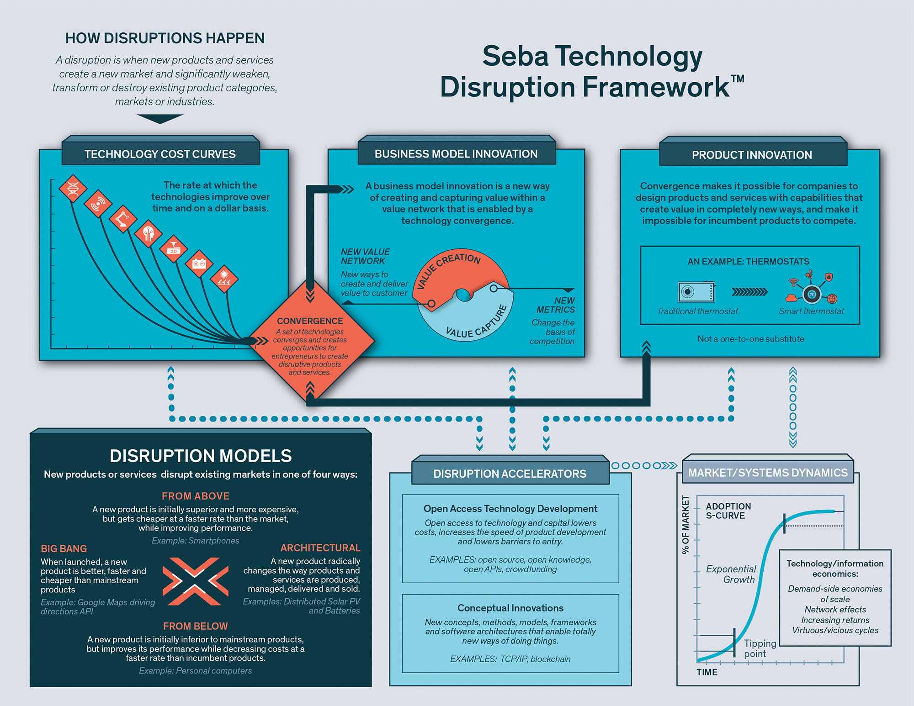

*本文译自 [Seba Technology Disruption Framework](https://tonyseba.com/wp-content/uploads/2014/05/STDF-booklet-binding-ok.pdf)。建议读者结合原文阅读。*

Seba 技术革新框架由 [Tony Seba](https://tonyseba.com/) 创建。这个框架是其经过十多年研究的结果，并被用作*高科技产品的营销策略与创新、商业与收入模式的创新、企业家的财务知识、预测与引领市场变革*等课程的内容出版和传授。Tony Seba 已经在斯坦福大学传授过数千名创业者与企业领导人。

这个框架是 Tony Seba 在 2014 年 7 月出版的书籍[《能源和交通的清洁革命》](https://book.douban.com/subject/30721678/)的核心构架，而该书籍准确预测到了由于电池、电动汽车、自动驾驶和太阳能光伏等技术，以及打车等商业模式对能源领域的持续革新。

这个框架被独立智库 RethinkX 用于分析和预测某项技术革新的范围、速度和规模及其可能会对整个社会产生的潜在影响。RethinkX 在 2017 年 5 月发布了他们的第一篇名为 [*Rethinking Transportation 2020-2030*](https://static1.squarespace.com/static/585c3439be65942f022bbf9b/t/591a2e4be6f2e1c13df930c5/1494888038959/RethinkX+Report_051517.pdf) 的行业报告。该报告由 James Arbib 和 Tony Seba 共同撰写，报告指出我们正处于历史上最快、最深远且最壮烈的交通变革中。

这篇文章便是一份 Seba 技术革新框架的入门指南。

## 革新

当新的产品和服务开辟了新的市场时，革新就发生了，革新过程会显著地削弱、摧毁或改变现有的产品类别、市场或者行业。比如数码相机就摧毁了胶片相机行业。但革新并不总是会破坏现有市场，比如互联网显著削弱了报纸出版行业，但并没有摧毁它；打车服务已经从根本上改变了出租车行业，但也还没有摧毁它。新的技术以及由这些技术所引发的新的商业模式融汇在一起，使得革新成为可能。开源社区也会加速革新的过程。

## 融汇

当几项独立发展的技术在某个时间点融汇在一起时，新的产品或者服务便可能会出现。苹果和谷歌在 2007 年分别发布了 iPhone 和 Android，期间相差仅仅几个月。这是因为技术的融汇使得制造智能手机成为了可能 —— 移动带宽、数码成像、触摸屏、计算性能、数据存储、云服务、锂电池和传感器 —— 都在 2007 年左右出现了。通过结合技术成本曲线和新的商业模式，Seba 技术革新框架可以帮助预测一组给定的技术将会在何时融汇，并为企业家们提供创造颠覆性产品和服务的机会。举例来说，Tony Seba 在 2014 年出版的书籍《能源和交通的清洁革命》就准确地预测到了在 2018 年续航 200 英里左右的商用电动车的成本（不含补贴）大致在 \$35,000 到 \$40,000 之间。其中通用 Bolt 和特斯拉 Model 3 —— 引领着这股电动车浪潮 —— 已经预售出了数十万辆汽车。

## 技术成本曲线

技术都有成本曲线，而这也体现出了某项技术随着时间推移的发展速度。最有名的技术成本曲线当然就是「摩尔定律」了，它假定算力每隔两年就会提升一倍。Seba 技术革新框架从经济层面研究了这些技术发展曲线，并着眼于如何降低每单位的成本。举例来说，当我们在分析电池时，我们可能会以每千瓦时的成本计算。

TODO
