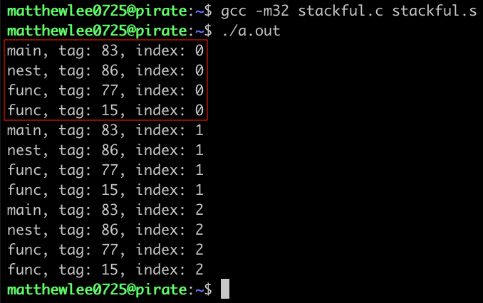

如今协程已经成为大多数语言的标配，例如 Golang 里的 goroutine，JavaScript 里的 async/await。尽管名称可能不同，但它们都可以被划分为两大类，一类是有栈 (stackful) 协程，例如 goroutine；一类是无栈 (stackless) 协程，例如 async/await。

此处「有栈」和「无栈」的含义不是指协程在运行时是否需要栈，对于大多数语言来说，一个函数调用另一个函数，总是存在调用栈的；而是指**协程是否可以在其嵌套函数中被挂起**，此处的嵌套函数读者可以理解为子函数、匿名函数等。显然有栈协程是可以的，而无栈协程则不可以。似乎难以理解？不要慌，让我们先从函数调用栈开始讲起。

注意，文中所有讨论均基于 x86 平台，在 x86 平台中，调用栈的地址增长方向是从高位向低位增长的。并且本文选取 32 位系统作为讨论对象，因为 16 位已经过时了；而 64 位又稍显复杂，所占篇幅较大，但读者可以轻易地将本文内容推演至 64 位。

## 函数调用栈

首先我们需要明确的是，调用栈是一段连续的地址空间，无论是 caller（调用方）还是 callee（被调用方）都位于这段空间之内。而调用栈中一个函数所占用的地址空间我们称之为「栈帧」(stack frame)，调用栈便是由若干个栈帧拼接而成的。一个典型的调用栈模型如下图所示，图片来自 [维基百科](https://en.wikipedia.org/wiki/Call_stack)：


图中涉及到几个关键点，Stack Pointer 即栈顶指针，总是指向调用栈的顶部地址，该地址由 esp 寄存器存储；Frame Pointer 即基址指针，总是指向当前栈帧（当前正在运行的子函数）的底部地址，该地址由 ebp 寄存器存储。Return Address 则在是 callee 返回后，caller 将继续执行的指令所在的地址；而指令地址是由 eip 寄存器负责读取的，且 eip 寄存器总是预先读取了**当前栈帧中**下一条将要执行的指令的地址。

我们可以很轻易地构造一段 C 代码，然后将其转换为汇编，看看底层究竟做了什么。笔者推荐使用 [Compiler Explorer](https://godbolt.org/) 查看汇编，相比直接在命令行使用 GCC/Clang 生成的汇编而言，更加简洁清晰。以下汇编由 x86_64 gcc 9.3 添加编译参数 `-m32` 生成，采用的是 AT&T 语法，不熟悉该语法的读者可猛击链接 [Linux 汇编语言开发指南](https://www.ibm.com/developerworks/cn/linux/l-assembly/index.html) 学习一番。

```c
int callee() { // callee:
               //   pushl %ebp
               //   movl  %esp, %ebp
               //   subl  $16, %esp
    int x = 0; //   movl  $0, -4(%ebp)
    return x;  //   movl -4(%ebp), %eax
               //   leave
               //   ret
}

int caller() { // caller:
               //   pushl %ebp
               //   movl  %esp, %ebp
    callee();  //   call  callee
    return 0;  //   movl  $0, %eax
               //   popl  %ebp
               //   ret
}
```

当 caller 调用 callee 时，执行了以下步骤（注意注释中的执行顺序：

```c
callee:
    // 3. 将 caller 的栈帧底部地址入栈保存
    pushl %ebp
    // 4. 将此时的调用栈顶部地址作为 callee 的栈帧底部地址
    movl  %esp, %ebp
    // 5. 将调用栈顶部扩展 16 bytes 作为 callee 的栈帧空间；
    //    在 x86 平台中，调用栈的地址增长方向是从高位向低位增长的，
    //    所以这里用的是 subl 指令而不是 addl 指令
    subl  $16, %esp
    ...
caller:
    ...
    // "call callee" 等价于如下两条指令：
    // 1. 将 eip 存储的指令地址入栈保存；
    //    此时的指令地址即为 caller 的 return address，
    //    即 caller 的 "movl $0, %eax" 这条指令所在的地址
    // 2. 然后跳转到 callee
    pushl %eip
    jmp callee
    ...
```


当 callee 返回 caller 时，则执行了以下步骤（注意注释中的执行顺序：

```c
callee:
    ...
    // "leave" 等价于如下两条指令：
    // 6. 将调用栈顶部与 callee 栈帧底部对齐，释放 callee 栈帧空间
    // 7. 将之前保存的 caller 的栈帧底部地址出栈并赋值给 ebp
    movl %ebp, %esp
    popl %ebp
    // "ret" 等价如下指令：
    // 8. 将之前保存的 caller 的 return address 出栈并赋值给 eip，
    //    即 caller 的 "movl $0, %eax" 这条指令所在的地址
    popl eip
caller:
    ...
    // 9. 从 callee 返回了，继续执行后续指令
    movl $0, %eax
    ...
```


以上便是函数调用栈的大致运行过程了。当然真实的调用栈运行过程要复杂一些，比如笔者就选择忽略了函数传参等细节以保持篇幅，读者若对此感兴趣，则推荐阅读这篇文章 [C Function Call Conventions and the Stack](https://www.csee.umbc.edu/~chang/cs313.s02/stack.shtml)。

## 有栈协程

实现一个协程的关键点在于如何保存、恢复和切换上下文。已知函数运行在调用栈上；如果将一个函数作为协程，我们很自然地联想到，保存上下文即是保存从这个函数及其嵌套函数的（连续的）栈帧存储的值，以及此时寄存器存储的值；恢复上下文即是将这些值分别重新写入对应的栈帧和寄存器；而切换上下文无非是保存当前正在运行的函数的上下文，恢复下一个将要运行的函数的上下文。有栈协程便是这种朴素思想下的产物。

回顾文章开头，笔者提到有栈协程是可以在其嵌套函数中被挂起的——毕竟它都能保存和恢复自己完整的上下文了，那自然是在哪里被挂起都可以。我们可以自己实现一个简单的例子证明这个事实，同时也有助于我们从底层理解有栈协程的运行过程。

首先我们需要 malloc 一段能存储上下文的内存空间。在保存上下文时，我们可以选择把上下文都拷贝到这段内存；亦或者直接将这段内存作为协程运行时的栈帧空间，这样就能避免拷贝带来的性能损失了。注意，如果申请的内存空间小了，协程在运行时会爆栈；如果大了，则浪费内存；不过具体的分配策略我们就不做过多讨论了。

同时还需要保存寄存器的值。这里便涉及到了函数调用栈中的一个知识点，[根据约定](https://en.wikipedia.org/wiki/X86_calling_conventions#Caller-saved_(volatile)_registers)，有的寄存器是由 caller 负责保存的，如 eax、ecx 和 edx；而有的寄存器是 callee 负责保存的，如 ebx、edi 和 esi。对于被调用的协程而言，只需要保存 callee 相关的寄存器的值，调用栈相关的 ebp 和 esp 的值，以及 eip 存储的 return address。

```c
// *(CTX + 0) 存储 return address
// *(CTX + 1) 存储 ebx
// *(CTX + 2) 存储 edi
// *(CTX + 3) 存储 esi
// *(CTX + 4) 存储 ebp
// *(CTX + 5) 存储 esp
char **init_ctx(char *func) {
    // 动态申请 1kb 内存作为栈帧空间
    size_t size = sizeof(char *) * 1024;
    char **ctx = malloc(size);
    memset(ctx, 0, size);
    // 将 func 的地址作为其栈帧 return address 的初始值，
    // 当 func 第一次被调度时，将从其入口处开始执行
    *(ctx + 0) = (char *) func;
    // 将 ctx 的内存地址作为其栈帧顶部地址的初始值
    *(ctx + 5) = (char *) ctx;
    return ctx;
}
```

读者应该注意到了，我们在初始化上下文的过程中，预设了 return address 和 esp 的初始值。这是因为 `func` 第一次被调度时，还没有现成的上下文，但 eip 需要指向一条明确的指令地址才能开始执行，这条指令地址自然就是 `func` 的入口地址；同时 `func` 刚开始运行时的栈帧底部即是调用栈栈顶（还记得 `movl %esp, %ebp` 吗），所以将 malloc 的内存地址设置为 esp 的初始值，便是将这段内存作为 `func` 运行时的栈帧空间了。

接下来，为了保存和恢复寄存器的值，我们还需要撰写几段汇编代码。假设此时我们已经将存储上下文的内存地址赋值给了 eax，则保存的逻辑如下：

```c
// 依次将各个寄存器的值存储
movl %esp, 20(%eax)
movl %ebp, 16(%eax)
movl %esi, 12(%eax)
movl %edi,  8(%eax)
movl %ebx,  4(%eax)

//  %esp  存储的是当前调用栈的顶部所在的地址，
// (%esp) 是顶部地址所指向的内存区域存储的值，
// 将这个值存储为 return address
movl (%esp), %ecx
movl %ecx, 0(%eax)
```

而与之相对应的恢复逻辑如下：

```c
// 依次将存储的值写入各个寄存器
movl 20(%eax), %esp
movl 16(%eax), %ebp
movl 12(%eax), %esi
movl  8(%eax), %edi
movl  4(%eax), %ebx

//  %esp  存储的是当前调用栈的顶部所在的地址，
// (%esp) 是顶部地址所指向的内存区域存储的值，
// 将存储的 return address 写入到该内存区域
movl 0(%eax), %ecx
movl %ecx, (%esp)
```

而前文已经说过，切换上下文无非是保存当前正在运行的函数的上下文，恢复下一个将要运行的函数的上下文。于是我们可以基于上述两段汇编构造一个 `void swap_ctx(char **current, char **next)` 函数，分别传入 `char **init_ctx(char *func)` 构造好的上下文即可实现切换。为了方便使用，我们可以将 `swap_ctx()` 封装成 `yield()` 函数，在这个函数里简单实现了不同函数的调度逻辑。于是一个简单的例子便完成了：

```c
char **MAIN_CTX;
char **NEST_CTX;
char **FUNC_CTX_1;
char **FUNC_CTX_2;

void nest_yield() {
    yield();
}

void nest() {
    // 随机生成一个整数作为 tag
    int tag = rand() % 100;
    for (int i = 0; i < 3; i++) {
        printf("nest, tag: %d, index: %d\n", tag, i);
        nest_yield();
    }
}

void func() {
    // 随机生成一个整数作为 tag
    int tag = rand() % 100;
    for (int i = 0; i < 3; i++) {
        printf("func, tag: %d, index: %d\n", tag, i);
        yield();
    }
}

int main() {
    MAIN_CTX = init_ctx((char *) main);

    // 证明 nest() 可以在其嵌套函数中被挂起
    NEST_CTX = init_ctx((char *) nest);

    // 证明同一个函数在不同的栈帧空间上运行
    FUNC_CTX_1 = init_ctx((char *) func);
    FUNC_CTX_2 = init_ctx((char *) func);

    int tag = rand() % 100;
    for (int i = 0; i < 3; i++) {
        printf("main, tag: %d, index: %d\n", tag, i);
        yield();
    }

    return 0;
}
```

完整的代码可通过 [这个链接](https://github.com/mthli/blog/blob/master/content/blog/stackful-stackless/) 获得，使用 `gcc -m32 stackful.c stackful.s` 编译，然后运行 `./a.out` 的得到如下结果：



可以注意到 `tag` 的值在每次调度过程中均未改变，而循环叠加 `index` 的逻辑也并未因为挂起和恢复受到影响。所以 `nest()` 的确是可以在其嵌套函数中被挂起；同时我们还证明了同一个函数被调用多次时，的确是在不同的栈帧空间上运行的。

## 无栈协程

TODO
