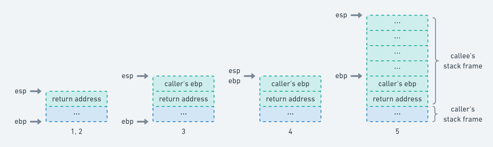
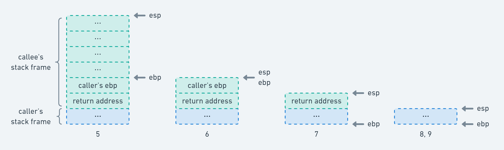

如今协程已经成为大多数语言的标配，例如 Golang 里的 goroutine，JavaScript 里的 async/await。尽管名称可能不同，但它们都可以被划分为两大类，一类是有栈 (stackful) 协程，例如 goroutine；一类是无栈 (stackless) 协程，例如 async/await。

此处「有栈」和「无栈」的含义不是指「协程在运行时是否需要栈」，对于大多数语言来说，一个函数调用另一个函数，总是存在调用栈的；而是指「协程是否可以在其嵌套函数中被挂起」，该定义可参见 Lua 团队关于协程的经典论文 [Revisiting Coroutines](http://www.inf.puc-rio.br/~roberto/docs/MCC15-04.pdf)。显然有栈协程是可以的，而无栈协程则不可以。尽管已经明确了定义，但似乎依然难以理解。不要慌，让我们先从函数调用栈开始讲起。

注意，文中所有讨论均基于 x86 平台，在 x86 平台中，调用栈的地址增长方向是从高位向低位增长的。并且本文选取 32 位系统作为讨论对象，因为 16 位已经过时了；而 64 位又稍显复杂，所占篇幅较大，但读者可以轻易地将本文内容推演至 64 位。

## 函数调用栈

首先我们需要明确的是，调用栈是一段连续的地址空间，无论是 caller（调用方）还是 callee（被调用方）都位于这段空间之内。而调用栈中一个函数所占用的地址空间我们称之为「栈帧」(stack frame)，调用栈便是由若干个栈帧拼接而成的。一个典型的调用栈模型如下图所示，图片来自 [维基百科](https://en.wikipedia.org/wiki/Call_stack)：


图中涉及到几个关键点，Stack Pointer 即栈顶指针，总是指向调用栈的顶部地址，该地址由 `esp` 寄存器存储；Frame Pointer 即基址指针，总是指向当前栈帧（当前正在执行的子函数）的底部地址，该地址由 `ebp` 寄存器存储。Return Address 则在是 callee 返回后，caller 将继续执行的指令所在的地址；而指令地址是由 `eip` 寄存器负责读取的，且 `eip` 寄存器总是预先读取了**当前栈帧中**下一条将要执行的指令的地址。

我们可以很轻易地构造一段 C 代码，然后将其转换为汇编，看看底层究竟做了什么。笔者推荐使用 [Compiler Explorer](https://godbolt.org/) 查看汇编，相比直接在命令行使用 GCC/Clang 生成的汇编而言，更加简洁清晰。以下汇编由 x86_64 gcc 9.3 添加编译参数 `-m32` 生成，采用的是 AT&T 语法，不熟悉该语法的读者可猛击链接 [Linux 汇编语言开发指南](https://www.ibm.com/developerworks/cn/linux/l-assembly/index.html) 学习一番。

```c
int callee() { // callee:
               //   pushl %ebp
               //   movl  %esp, %ebp
               //   subl  $16, %esp
    int x = 0; //   movl  $0, -4(%ebp)
    return x;  //   movl  -4(%ebp), %eax
               //   leave
               //   ret
}

int caller() { // caller:
               //   pushl %ebp
               //   movl  %esp, %ebp
    callee();  //   call  callee
    return 0;  //   movl  $0, %eax
               //   popl  %ebp
               //   ret
}
```

当 caller 调用 callee 时，执行了以下步骤（注意注释中的执行顺序：

```c
callee:
    // 3. 将 caller 的栈帧底部地址入栈保存
    pushl %ebp
    // 4. 将此时的调用栈顶部地址作为 callee 的栈帧底部地址
    movl  %esp, %ebp
    // 5. 将调用栈顶部扩展 16 bytes 作为 callee 的栈帧空间；
    //    在 x86 平台中，调用栈的地址增长方向是从高位向低位增长的，
    //    所以这里用的是 subl 指令而不是 addl 指令
    subl  $16, %esp
    ...
caller:
    ...
    // "call callee" 等价于如下两条指令：
    // 1. 将 eip 存储的指令地址入栈保存；
    //    此时的指令地址即为 caller 的 return address，
    //    即 caller 的 "movl $0, %eax" 这条指令所在的地址
    // 2. 然后跳转到 callee
    pushl %eip
    jmp callee
    ...
```



当 callee 返回 caller 时，则执行了以下步骤（注意注释中的执行顺序：

```c
callee:
    ...
    // "leave" 等价于如下两条指令：
    // 6. 将调用栈顶部与 callee 栈帧底部对齐，释放 callee 栈帧空间
    // 7. 将之前保存的 caller 的栈帧底部地址出栈并赋值给 ebp
    movl %ebp, %esp
    popl %ebp
    // "ret" 等价如下指令：
    // 8. 将之前保存的 caller 的 return address 出栈并赋值给 eip，
    //    即 caller 的 "movl $0, %eax" 这条指令所在的地址
    popl eip
caller:
    ...
    // 9. 从 callee 返回了，继续执行后续指令
    movl $0, %eax
    ...
```



以上便是函数调用栈的大致执行过程了。我们主要着力于 `ebp` 、`esp` 、`eip` 、return address 这四点，同时也是接下来有栈协程切换上下文的关键之处。注意，文中选择忽略了函数传参等细节以保持篇幅，读者若对此感兴趣，则推荐阅读这篇文章 [C Function Call Conventions and the Stack](https://www.csee.umbc.edu/~chang/cs313.s02/stack.shtml)。

## 有栈协程

协程的一个特性便是可以被挂起和恢复。回顾文章开头，我们提到有栈协程和无栈协程的的区别在于是否可以在其嵌套函数中被挂起，读者可以将此处的「嵌套函数」理解为子函数、匿名函数等概念的统称。

如果一个协程能在其嵌套函数中被挂起，并且还能在嵌套函数处恢复，那么必然要保存完整的运行时上下文，同时还需要一种能恢复上下文的机制。协程作为一种泛化的函数，自然也是运行在栈帧之上的：保存其运行时上下文，也就是保存其栈帧存储的值；恢复上下文，也就是恢复其栈帧存储的值。显然，如果你可以保存和恢复栈帧，那么再配上切换栈帧的机制，就可以决定当前执行哪一个协程了，而这正是有栈协程的运行原理。

我们可以尝试构造一个简单的例子。回顾一下函数调用栈，如果读者足够聪明，便会发现对于保存和恢复栈帧，我们几乎不用做什么操作，毕竟协程的栈帧已经存在调用栈中了，它又不会跑；关键在于如何切换上下文，

TODO
