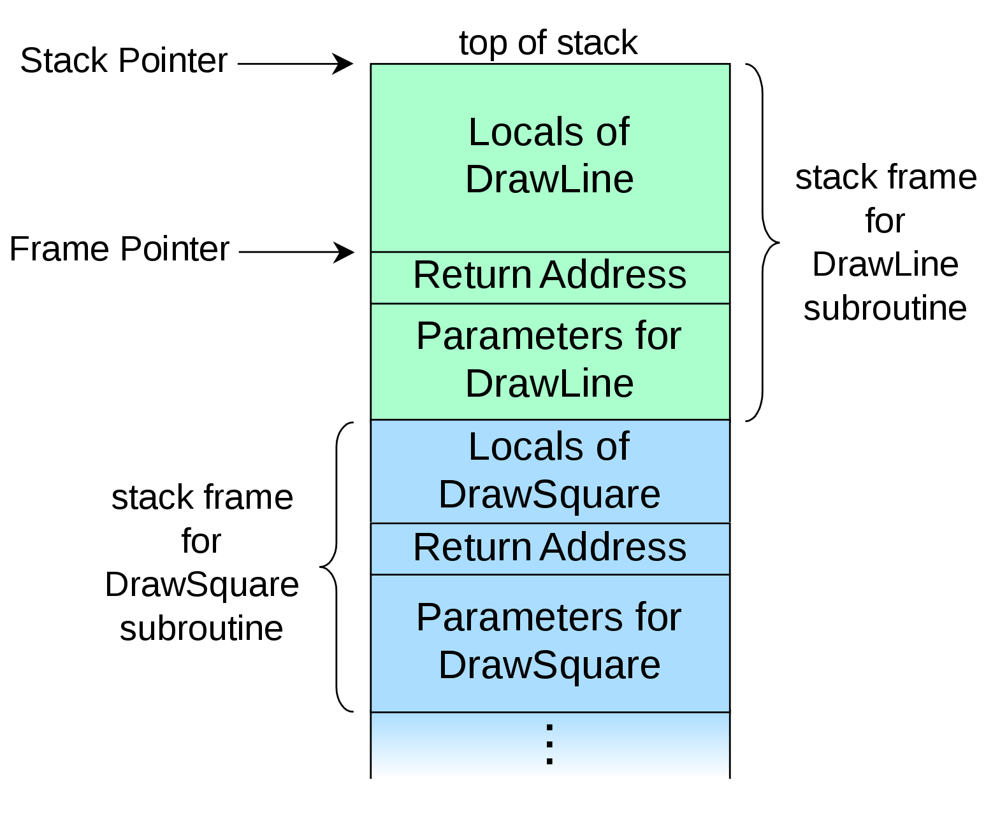

如今协程已经成为大多数语言的标配，例如 Golang 里的 goroutine，JavaScript 里的 async/await。尽管名称可能不同，但它们都可以被划分为两大类，一类是有栈 (stackful) 协程，例如 goroutine；一类是无栈 (stackless) 协程，例如 async/await。

此处「有栈」和「无栈」的含义不是指在协程运行时是否需要栈，对于大多数语言来说，一个函数调用另一个函数，总是存在调用栈的；而是指**在当前协程被挂起时，是否需要使用额外的栈结构存储上下文，**显然「有栈」是需要的，而「无栈」是不需要的。尽管已经明确了定义，但似乎依然难以理解。不要慌，让我们先从函数调用栈开始讲起。

## 函数调用栈

首先我们需要明确的是，调用栈是一段连续的地址空间，无论是 caller（调用方）还是 callee（被调用方）都处于这段空间之内。而调用栈中一个子函数所占用的空间片段我们称之为「栈帧」(stack frame)，调用栈便是由若干个栈帧拼接而成的。

我们可以很轻易地构造一段 C 代码，然后将其转换为汇编，看看底层究竟做了什么。笔者推荐使用 [Compiler Explorer](https://godbolt.org/) 查看汇编，相比直接在命令行调用 GCC/Clang 生成的汇编而言，更加简洁清晰。以下便是笔者构造的 C 代码，以及每一行对应的 32 位 [AT&T 汇编](https://www.ibm.com/developerworks/cn/linux/l-assembly/index.html)（由 x86_64 gcc 9.3 添加编译参数 `-m32` 生成：

```c
int callee() { // callee:
               // highlight-start
               //   pushl %ebp
               //   movl  %esp, %ebp
               //   subl  $16, %esp
               // highlight-end
    int x = 0; //   movl  $0, -4(%ebp)
    return x;  //   movl  -4(%ebp), %eax
               // highlight-start
               //   leave
               //   ret
               // highlight-end
}

int caller() { // caller:
               // highlight-start
               //   pushl %ebp
               //   movl  %esp, %ebp
               // highlight-end
    callee();  //   call  callee
    return 0;  //   movl  $0, %eax
               // highlight-start
               //   popl  %ebp
               //   ret
               // highlight-end
}
```

注意，`leave` 指令等价于以下两条指令：

```c
movl %ebp, %esp
popl %ebp
```

于是在代码高亮部分，`pushl` 和 `popl` 指令总是成对出现，分别对应入栈和出栈操作。并且总是存在 `ebp` 基地址指针 (frame base pointer) 寄存器和 `esp` 堆栈指针 (stack pointer) 寄存器，前者指向当前栈帧的基地址，可以通过计算相对基地址的偏移量读写对应的地址空间；后者总是指向当前调用栈的顶部（同时也是当前栈帧的顶部）。于是我们可以大概勾勒出调用栈的运行步骤了：

1. 当 caller 调用 callee 时，首先执行 `pushl %ebp` 将 caller 的栈帧基地址入栈保存；接着执行 `movl %esp, %ebp` 将当前调用栈的栈顶地址作为 callee 的栈帧基地址；然后执行 `subl $16, %esp` 将当前调用栈的栈顶指针向低位移动 16 bytes 作为 callee 的栈帧空间。注意，对于 x86 平台而言，调用栈地址空间是从高位向低位生长的

2. 当 callee 正在运行时，会使用到部分寄存器和栈帧空间，例如 `movl $0, -4(%ebp)` 即是将整数 0 存储在自己的栈帧基地址向低位偏移 4 bytes 的位置上

3. 当 callee 运行完毕准备返回时，首先执行 `movl %ebp, %esp` 将当前调用栈的栈顶指针与自己的栈基地址对齐，释放自己占用的地址空间；接着执行 `popl %ebp` 恢复 caller 的栈帧基地址；然后执行 `ret` 指令将执行控制权交还给 caller

当然啦，真实的栈帧模型要比笔者列举的情况复杂一些，其中还涉及 callee 的传参和返回值应的存储问题。以下是一张引用自 [维基百科](https://en.wikipedia.org/wiki/Call_stack) 的栈帧模型图片：



为了与 x86 平台相对应，我们可以假定图片上半部分是低位地址，下半部分是高位地址。

读者可能已经注意到了，图中一个栈帧所占用的地址空间并不局限于其基地址到栈顶之间，还包括基地址之下（高位）的一段连续空间，分别用于存储 callee 的传参和返回值。同样的，我们可以通过计算相对基地址的偏移量读取到这些值，只不过此时是向高位偏移；并且在 callee 返回后，caller 还需要继续向高位移动 `esp` 释放掉 callee 的传参和返回值所占用的地址空间。此处笔者推荐阅读 [C Function Call Conventions and the Stack](https://www.csee.umbc.edu/~chang/cs313.s02/stack.shtml) 以了解详细的运行步骤，而关于函数调用栈的各种细节就不在此展开了。

## 有栈协程

TODO
