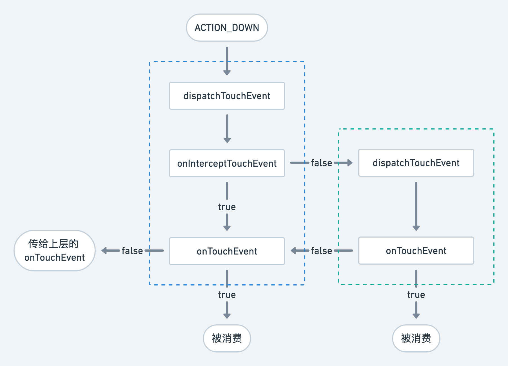
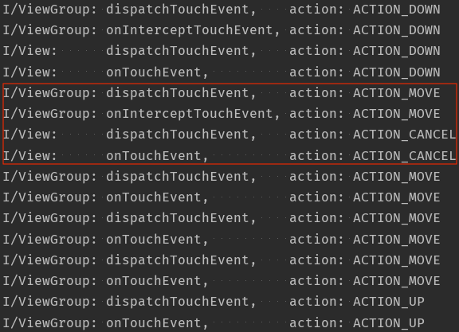
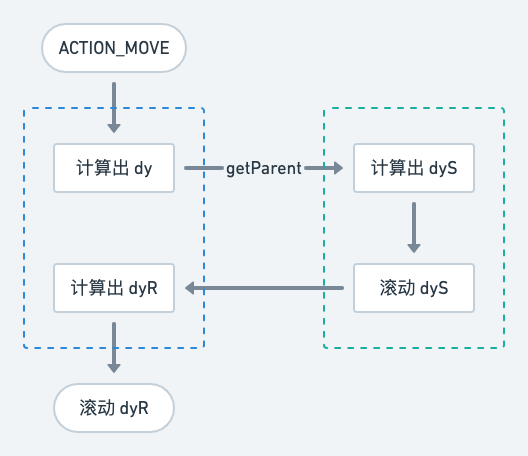

关于触摸事件的分发是一道常见的 Android 面试题，而下一题一般都是嵌套滚动。在笔者前几年的 Android 开发经历中，其实很少接触到嵌套滚动。嵌套滚动在大多数场景中其实是一种不被推荐的交互方案。不过为了准备面试，我们还是来研究一下。

## 触摸事件的分发

首先我们来回顾一个触摸事件分发的最简模型，即将 MotionEvent 从 ViewGroup 传递到其子 View 的流程。很多博客会把 Activity 也算上，可以但没有必要。



这里我们选用 ACTION\_DOWN 作为示例的输入事件，因为它是一次完整的触摸交互（从手指接触屏幕到离开屏幕）的起点，并且会重置上一次交互的所有状态：

```java
public abstract class ViewGroup {
  ...
  @Override
  public boolean dispatchTouchEvent(MotionEvent ev) {
    ...
    final int action = ev.getAction();
    final int actionMasked = action & MotionEvent.ACTION_MASK;
    // 如果是 ACTION_DOWN，则重置上一次交互的所有状态
    if (actionMasked == MotionEvent.ACTION_DOWN) {
      cancelAndClearTouchTargets(ev);
      resetTouchState();
    }
    ...
  }
}
```

注意 ViewGroup 的 onInterceptTouchEvent，它决定了当前事件是否应该被拦截，不传递给子 View。如果拦截的是 ACTION\_DOWN，则此时子 View 不会（也不应该）接收到任何事件；但如果拦截的是其他事件，比如 ACTION\_MOVE，假设此前已经有子 View 消费了 ACTION\_DOWN，则此时它会接收到一个 ACTION\_CANCEL，毕竟触摸事件要有始有终：



继续观察红框部分之下的 ACTION\_MOVE 和 ACTION\_UP，为什么此时 ViewGroup 没有执行 onInterceptTouchEvent 呢？我们可以看到如下源码中的淡黄色高亮部分：

```java
public abstract class ViewGroup {
  ...
  @Override
  public boolean dispatchTouchEvent(MotionEvent ev) {
    ...
    final boolean intercepted;
    // highlight-start
    // 如果是 ACTION_DOWN，或者已经存在消费触摸事件的子 View
    if (actionMasked == MotionEvent.ACTION_DOWN || mFirstTouchTarget != null) {
    // highlight-end
      // 如果有子 View 调用了 requestDisallowInterceptTouchEvent(true)
      final boolean disallowIntercept = (mGroupFlags & FLAG_DISALLOW_INTERCEPT) != 0;
      if (!disallowIntercept) {
        intercepted = onInterceptTouchEvent(ev);
        // 重新设置一次 action，简单防止它被修改过
        ev.setAction(action);
      } else {
        intercepted = false;
      }
    } else {
      // highlight-start
      // 如果不是 ACTION_DOWN，并且不存在消费触摸事件的子 View，
      // 则此时可以认为 ViewGroup 正在持续拦截触摸事件
      intercepted = true;
      // highlight-end
    }
    ...
  }
}
```

前面说过，当 onInterceptTouchEvent 拦截的是 ACTION\_MOVE 时，则此前已经消费了 ACTION\_DOWN 的子 View 会接收到一个 ACTION\_CANCEL；之后便不存在消费触摸事件的子 View 了，于是也就不需要执行 onInterceptTouchEvent 了。

读者可以 [在这里](https://github.com/mthli/AndroidPlayground/tree/master/app/src/main/java/io/github/mthli/playground/module/touch) 获取上述完整的 Log 代码。同时注意 `mFirstTouchTarget` 这个变量其实是一个单链表的头部，即表示响应触摸事件的子 View 可能不止一个，具体可以参见 [这篇微信文章](https://mp.weixin.qq.com/s/-yx5SB0-3zt8NJeCEUp5-Q)，这里就不展开了，一般我们还是认为响应触摸事件的子 View 只有一个。

## 嵌套滚动

一般来说，嵌套滚动是指相同滚动方向的视图嵌套，比如纵向滑动的 ScrollView 内部嵌套了纵向滑动的 RecyclerView。读者如果在 [即刻 App](https://www.okjike.com/) 的个人页用手指按住屏幕，向上滚动至隐藏头部信息以后，便可看到个人动态还会自然地滚动一段距离，中间没有任何卡顿：

<figure class="gatsby-resp-image-figure">
  
  <figcaption class="gatsby-resp-image-figcaption">即刻 App 个人页嵌套滚动效果</figcaption>
</figure>

我们可以简单认为上图的布局为最外层 ScrollView + 个人动态 RecyclerView。基于之前触摸事件的分发，一定有一个 View 消费了触摸事件。以上图中的交互为例：

1. 如果是 ScrollView，需要考虑当头部信息没有隐藏时，怎么拦截滚动而不是拦截点击。当头部信息已经隐藏时，则不应该拦截任何事件，全部传递给 RecyclerView；同时还需要考虑怎么把剩余的 fling 速度传递给 RecyclerView，保证体验的流畅性
2. 如果是 RecyclerView，需要考虑当头部信息没有隐藏时，怎么同时联动 ScrollView。当头部信息已经隐藏时，则不需要联动

稍有经验的读者都会看出，情况 1 无异于螳臂当车。对于情况 2，其实联动的原理非常简单：假设手指移动的距离为 dy；RecyclerView 在滚动之前，先询问父布局 ScrollView 是否需要消费 dy 中的一部分 dyS，接着自己再消费掉剩下的那部分 dyR；即 dy = dyS + dyR。



以上过程可以由开发者在 RecyclerView 的 onTouchEvent 中自行编码完成；也可以使用 Google 官方定义好的嵌套滚动接口 [NestedScrollingParent](https://developer.android.com/reference/androidx/core/view/NestedScrollingParent) 和 [NestedScrollingChild](https://developer.android.com/reference/androidx/core/view/NestedScrollingChild)。

其实直接使用 [NestedScrollView](https://developer.android.com/reference/androidx/core/widget/NestedScrollView) + RecyclerView 就可以很轻易地实现类似即刻 App 个人页的布局，因为这两个 View 均已实现了上述两个嵌套滚动接口。受限于篇幅原因，这里就不展开了。感兴趣的读者可以 [在这里](https://github.com/mthli/AndroidPlayground/tree/master/app/src/main/java/io/github/mthli/playground/module/nestedscrolling) 获取示例代码，结合嵌套滚动接口的官方文档自行分析。
