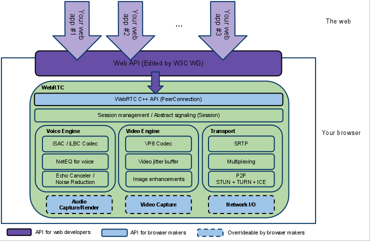

快三个月没写博客了，这段时间换了工作，从北京搬家到了深圳；工作内容也从原本的写界面做交互变成了围绕 [WebRTC](https://webrtc.org/) 做音视频直播相关的开发。虽说有点临时顶包的意味，但笔者本人却并不排斥。未来是多媒体的时代，图文的发展空间将被进一步压缩。

因为之前没有任何这方面的经验，所以笔者也是处于边学习边工作的状态。而中文互联网上关于 WebRTC 的资料比较匮乏，于是笔者便萌生了自己撰写一份 WebRTC 的学习资料的想法。接下来的一系列文章将会围绕笔者的工作内容展开，虽然内容不一定全面，但还是希望能给各位读者提供一份尽可能高质量的参考（如果你可以 Google 到的话）。

---

WebRTC 全称 Web Real-Time Communications，即一套基于 Web 的实时通信**解决方案**。它允许网站在不借助中间媒介的情况下，建立浏览器之间的点对点（Peer-to-Peer）连接，从而实现视频流和（或）音频流或者其他任意数据的传输。关于 WebRTC 有一套具体的 [实现标准](https://www.w3.org/TR/webrtc/)，而目前各大浏览器厂商如 Chrome、Firefox、Safari 等均已支持。

虽然传统意义上这套方案是给浏览器用的，但就像 Chrome 的 V8 引擎可以被单独移植出来做 Node.js 的底层一样，它的 WebRTC 模块也可以被单独编译为 Native 库给 Android 和 iOS 使用，从而实现了跨平台。我们一般也是基于 Chrome 的这份实现来做二次开发的。

现在让我们来看看 WebRTC 的官方（上古）构架图：

可以看到，WebRTC 基本可以分为三大部分：

1. 传输层（Transport），包含点对点协议（P2P）和安全实时传输协议（SRTP）等实现。
2. 视频引擎（Video Engine），包含视频编解码器（图中为 VP8 格式）、视频抖动缓冲器（Jitter Buffer）和图像增强等模块。
3. 音频引擎（Voice Engine）。包含音频编解码器（iSAC 用于宽带宽，iLBC 用于窄带宽）、音频抖动缓冲器（NetEQ 是 Jitter Buffer 的一种实现）和音频降噪等模块。

因此笔者在这里再次强调（并非玩弄文字游戏），与其说 WebRTC 是一项「技术」，不如说是一套「解决方案」，即上述三大部分集合在一起成为了这套解决方案。

读者大可不必现在就弄清楚上面出现的各种名词，笔者接下来将从传输层（Transport）开始讲起。实际上这也是笔者目前的工作重点，即构建一个 Android 端的 RTC 连接 SDK。